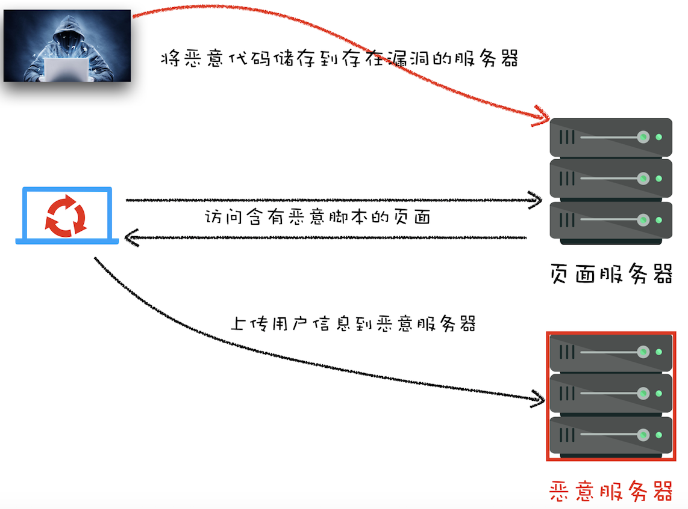

# XSS 攻击

因为同源策略下，浏览器支持页面引用第三方资源，通过 CORS 支持跨域请求，XSS 可以利用这两点攻击页面。

1. 窃取 Cookie 信息。恶意脚本通过`document.cookie`获取，利用 CORS 通过 XMLHttpRequest 将数据发送给恶意服务器。
2. 监听用户行为。恶意脚本使用`addEventListener`可以监听键盘事件，获取用户的输入信息。
3. 修改 DOM 伪造假页面。
4. 在页面内生成浮窗广告。

## XSS 的注入方式

- 在 HTML 中内嵌的文本中，恶意内容以 script 标签形成注入。
- 在内联的 JavaScript 中，拼接的数据突破了原本的限制（字符串，变量，方法名等）。
- 在标签属性中，恶意内容包含引号，从而突破属性值的限制，注入其他属性或者标签。
- 在标签的 href、src 等属性中，包含 javascript: 等可执行代码。
- 在 onload、onerror、onclick 等事件中，注入不受控制代码。
- 在 style 属性和标签中，包含类似 background-image:url("javascript:..."); 的代码（新版本浏览器已经可以防范）。
- 在 style 属性和标签中，包含类似 expression(...) 的 CSS 表达式代码（新版本浏览器已经可以防范）。

### 存储型 XSS

- hacker 将恶意 JS 代码提交到网站数据库中
- 用户向网站请求包含了恶意 JS 脚本的页面
- 用户浏览页面时，恶意脚本可以获取用户 Cookie 等信息



### 反射型 XSS

恶意 JS 脚本包含在了用户请求中，服务器收到请求会把恶意代码反射给浏览器，但不会存储在服务器中。

比如，页面会显示 URL 参数 xss 的值，如果在 URL 的参数中输入`http://localhost:3000/?xss=<script>alert("已被xss攻击")</script>`，那么这段恶意代码就会被插入页面，反射到用户页面。

### 基于 DOM 的 XSS

这种 XSS 与服务器无关，hacker 将恶意脚本注入页面，修改 HTML 页面内容。

## 如何阻止 XSS 攻击

> [如何防止 XSS 攻击？](https://juejin.im/post/5bad9140e51d450e935c6d64)

需要阻止**恶意脚本的注入**和**恶意消息的发送**。

1. 服务器对输入脚本进行过滤或转码
2. 利用 CSP，[MDN](https://developer.mozilla.org/zh-CN/docs/Web/HTTP/CSP)文档。服务器响应头配置`Content-Security-Policy`，或者在 HTML 文件的`meta`标签中添加，指定浏览器可执行的有效来源，让浏览器只执行白名单域中的脚本文件。
   1. 限制浏览器加载其他域的资源文件
   2. 禁止向第三方域提交数据
   3. 禁止执行内联脚本和未授权的脚本
   4. 提供了上报机制
3. 使用 HttpOnly 属性。在响应头的 set-cookie 里添加 HttpOnly 字段，那么站点的 Cookie 只能在 HTTP 请求中使用，JS 无法读取这段 Cookie

### 输入过滤

underscore 里的`escape`将以下字符做了转义，使用 hex code 代替这些字符：

```js
// List of HTML entities for escaping.
var escapeMap = {
  "&": "&amp;",
  "<": "&lt;",
  ">": "&gt;",
  '"': "&quot;",
  "'": "&#x27;",
  "`": "&#x60;",
};
// origin
("<script>alert('XSS');</script>");
// escaped
("&lt;script&gt;alert(&#x27;XSS&#x27;);&lt;/script&gt;");
```

这种过滤对于内联样式、内联 JS、内联 JSON 并不起效，需要使用更完善的转义策略。Java 工程库中常用的转义库为`org.owasp.encoder`.

> 与`encodeURI`和`encodeURIComponent`不同，这两个 API 将 URL 中的特殊符号转成 utf-8 的 16 进制表示。

### 预防 DOM 型的 XSS

- 在使用 `.innerHTML`、`.outerHTML`、`document.write()` 时要特别小心，不要把不可信的数据作为 HTML 插到页面上，而应尽量使用 `.textContent`、`.setAttribute()` 等。
- 用 Vue/React 技术栈，并且不使用 `v-html`/`dangerouslySetInnerHTML` 功能，就在前端 render 阶段避免 `innerHTML`、`outerHTML` 的 XSS 隐患。
- 避免使用 DOM 中的内联事件监听器，如 `location=字符串`、`onclick`、`onerror`、`onload`、`onmouseover` 等 API，用`addEventListener`更合适。
- `<a>` 标签的 `href=字符串` ，避免使用 `eval()`、`setTimeout()`、`setInterval()` 等 API，不能拼接代码。

### React 如何预防 XSS

1. `createElement`会把`script`的 JSX，使用`innerHTML`的形式，包在一个`div`里，防止`script`执行。
2. `updateDOMProperties`判断是否通过`dangerouslySetInnerHTML`设置，如果是使用这个 API，则会用`setInnerHTML`去设置`innerHTML`，否则会用`setTextContent`把输入设置成文本。
