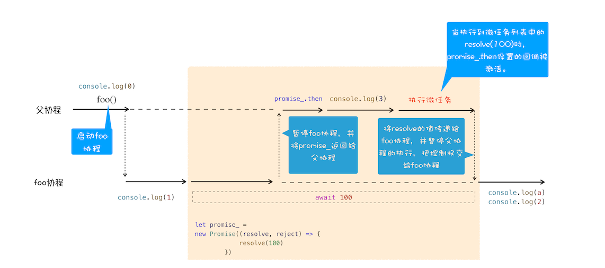

# async/await 的原理

使用 Promise 让请求流程线性化，但是会包含大量的 then 函数。

引入 async/await，**提供了在不阻塞主线程的情况下，使用同步代码实现异步访问资源的能力**。

## 生成器和协程

### 生成器函数

- 声明时带星号，在函数内部执行代码时，遇到 yield 关键字，V8 会返回关键字后面的内容给外部，并暂停这个函数的执行。
- 外部函数通过 next 方法恢复函数的执行。

### 协程

V8 如何实现一个函数的暂停和恢复呢？利用协程。

协程比线程更加轻量，可以看成跑在线程上的任务，一个线程可以有多个协程，但是同时只能执行一个协程。例如，当前执行的 A 协程要启动 B 协程，A 就会把主线程的控制权交给 B，看上去就像是 A 暂停执行，B 恢复执行。如果说，从 A 协程启动 B 协程，那么 A 协程就是 B 协程的父协程。

协程不被操作系统内核控制，由程序控制，这样就不会因为切换协程而消耗资源。

```js
function* genDemo() {
  console.log("开始执行第一段");
  yield "generator 2";
  console.log("开始执行第二段");
  yield "generator 2";
  console.log("开始执行第三段");
  yield "generator 2";
  console.log("执行结束");
  return "generator 2";
}
console.log("main 0");
let gen = genDemo();
console.log(gen.next().value);
console.log("main 1");
console.log(gen.next().value);
console.log("main 2");
console.log(gen.next().value);
console.log("main 3");
console.log(gen.next().value);
console.log("main 4");
```


> 这段代码里的调用栈又是什么情况呢？

- gen 协程和父协程在主线程上交互执行，不是并发执行，切换通过 yield 和 gen.next 配合完成。
- gen 协程调用 yield 方法时，V8 会保存 gen 协程当前的调用栈信息，恢复父协程的调用栈信息。反之亦然。


### 应用

```js
//foo函数
function* foo() {
  let response1 = yield fetch("https://www.google.com");
  console.log("response1");
  console.log(response1);
  let response2 = yield fetch("https://www.youtube.com");
  console.log("response2");
  console.log(response2);
}
//执行foo函数的代码
let gen = foo();
function getGenPromise(gen) {
  return gen.next().value;
}
getGenPromise(gen)
  .then((response) => {
    console.log("response1");
    console.log(response);
    return getGenPromise(gen);
  })
  .then((response) => {
    console.log("response2");
    console.log(response);
  });
```

- 执行`let gen = foo()`创建 gen 协程。
- 父协程执行`getGenPromise`，`gen.next`语句将主线程的控制权交给 gen 协程。
- gen 协程在主线程上执行，调用 fetch 创建 Promise 对象 response1，通过 yield 暂停 gen 协程的执行，将 response1 返回给父协程。
- 父协程恢复执行，调用`response1.then`等待返回结果。
- fetch 发起的请求完成后，调用`response1.then`中的回调函数，打印结果，再次调用`getGenPromise`方法，其中的`gen.next`将控制权交给 gen 协程，继续执行下个请求。

协程和 Promise 的相互配合如上，如果把执行生成器的代码封装成函数，co 框架做了这件事，这个执行生成器代码的函数就是执行器。

## async/await

### async

从 MDN 来看，async 是一个通过**异步执行**再**隐式返回 Promise**为结果的函数。

```js
async function foo() {
  return 2;
}
console.log(foo()); // Promise {<resolved>: 2}
```

### await

```js
async function foo() {
  console.log(1);
  let a = await 100;
  console.log(a);
  console.log(2);
}
console.log(0);
foo();
console.log(3);
```



- 执行`await 100`时，默认创建一个 Promise 对象 promise\_，resolve 执行的任务被提交到微任务队列中。
- V8 暂停 foo 协程，将 promise\_对象返回给父协程。
- 父协程调用`promise_.then`监控 promise 的状态变化。
- 父协程继续执行，当父协程即将执行结束时，需要清空当前的微任务队列，队列中的`resolve(100)`等待被执行，执行`resolve(100)`时，会触发`promise_.then(cb)`中的调用函数。

  ```js
  promise_.then((value) => {
    a = value;
    console.log(a);
    console.log(2);
  });
  ```

- 回调函数被激活，主线程的控制权交给 foo 协程，将 value 值传递给该协程。
- foo 协程激活后，将得到的 value 赋值给变量 a，foo 协程继续执行后续语句，执行完成后，将控制权归还给父协程。

### 例子

```js
async function foo() {
  console.log("foo");
}
async function bar() {
  console.log("bar start");
  await foo();
  console.log("bar end");
}
console.log("script start");
setTimeout(function () {
  console.log("setTimeout");
}, 0);
bar();
new Promise(function (resolve) {
  console.log("promise executor");
  resolve();
}).then(function () {
  console.log("promise then");
});
console.log("script end");
// 打印结果
// 宏任务列表：setTimeout
// 微任务列表：bar end, promise then
// script start
// bar start
// foo
// promise executor
// script end
// bar end
// promise then
// setTimeout
```
