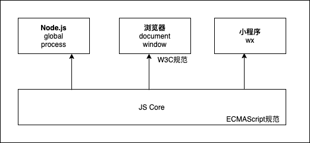

# 模块化与 webpack 原理

## 模块化规范

### CommonJS

- Node.js 的模块化规范，只能在 node 环境使用
- 每个模块都是单例，不会重复创建模块的实例
- 同步加载
- 内置 API`require`和`module.exports`进行导入导出

### AMD

- 在浏览器环境下使用
- 每个模块都是单例，不会重复创建模块的实例，后面的加载都是这个单例的缓存
- 异步加载
- 调用外置库`require.js`的 API`require`和`define`进行导入导出

### ESModule

前两个的问题在于，模块化规范由环境决定，相互之间不能共用模块。

ESModule 使得在 JS 语言层面上实现了模块化，使用`import`和`export`进行导入导出。



每个运行环境会封装环境相关的 API，ESModule 是在 JS Core 层面的规范，而 CommonJS 和 AMD 是运行环境层面的规范。当环境升级 JS 解释引擎，就会把`import`和`export`这些看作语法，剩下的是做兼容工作。Node.js 在 v12 后可以使用，Chrome 61 后支持。由于用浏览器版本无法控制，需要用 webpack 打包，用 Babel 编译从而兼容低版本的浏览器。

### Babel 编译

Babel 将 ESModule 相关的关键字转换成了 CommonJS 规范。

```js
// origin
import "moduleA";
export default function () {
  console.log("export");
}
// Babel 编译
("use strict");
Object.defineProperty(exports, "__esModule", {
  value: true,
});
exports.default = _default;
require("moduleA");
function _default() {
  console.log("export");
}
```

编译后的代码无法运行在浏览器中，所以在编译后，还需要进行打包，让无论是 AMD 还是 CommonJS 规范的模块，在打包处理后，可以直接运行在浏览器和 Node.js 中。

## 如何处理打包

### Node.js 的模块导入


`lib/module.js`里提供的两个核心 API `Module._load`和`Module._compile`实现了导入模块的功能。

```js
Module._load = function (request, parent, isMain) {
  // 1. Check Module._cache for the cached module.
  // 2. Create a new Module instance if cache is empty.
  // 3. Save it to the cache.
  // 4. Call module.load() with your the given filename.
  //    This will call module.compile() after reading the file contents.
  // 5. If there was an error loading/parsing the file,
  //    delete the bad module from the cache
  // 6. return module.exports
};
```

```js
Module.prototype._compile = function (content, filename) {
  // 1. Create the standalone require function that calls module.require.
  // 2. Attach other helper methods to require.
  // 3. Wraps the JS code in a function that provides our require,
  //    module, etc. variables locally to the module scope.
  // 4. Run that function
};
```

第三步，wrapped function 如下，立即执行函数不会污染运行环境，且在任意环境下都可以运行。

```js
(function (exports, require, module, __filename, __dirname) {
  // YOUR CODE INJECTED HERE!
});
```

> 参考文章：
>
> - [How Require Works - From James M. Snell](https://hackernoon.com/node-js-tc-39-and-modules-a1118aecf95e)
> - [How the module system, CommonJS & require works](https://blog.risingstack.com/node-js-at-scale-module-system-commonjs-require/)
> - [Everything you should know about ‘module’ & ‘require’ in Node.js](https://medium.com/free-code-camp/require-module-in-node-js-everything-about-module-require-ccccd3ad383)

### 实现简单的模块导入

目的：学习 Node.js 的方式，实现模块导入，可以在浏览器和 node 中使用。

#### 实现读取模块内容 module

```js
// 打包效果 index.bundle.js
(function () {
  var moduleA = function (exports, require, module) {
    console.log("hello bundler");
    module.exports = "hello world";
  };
  // 自定义 moduleA 的 module 对象，并有 exports 属性
  var requireA = {
    exports: {},
  };
  // 相当于 require 导入
  moduleA(null, null, requireA);
  // 获取到了 moduleA 的导出模块对象，并执行了 moduleA 的代码
  console.log(requireA.exports);
})();
```

```js
// 做成匿名模块放到数组里，处理多个模块导入
(function () {
  var moduleList = [
    function (exports, require, module) {
      console.log("hello bundler");
      module.exports = "hello world";
    },
  ];
  var requireList = [{ exports: {} }];
  moduleList[0](null, null, requireList[0]);
})();
```

抽出模板，把模块内容读取并写入到模板中。

```js
// index.template.js
(function () {
  var moduleList = [
    function (exports, require, module) {
      /** template */
    },
  ];
  var requireList = [{ exports: {} }];
  moduleList[0](null, null, requireList[0]);
})();
// bundle.js
const path = require("path");
const fs = require("fs");

const template = fs.readFileSync(
  path.resolve(__dirname, "index.template.js"),
  "utf-8"
);
// 读取需要导入模块文件内容
const target = fs.readFileSync(
  path.resolve(__dirname, "module/index.js"),
  "utf-8"
);
// 把模块内容替换模板文件中的注释部分
const content = template.replace("/** template */", target);
// 输出打包后的文件，与第一版的内容相同
fs.writeFileSync(
  path.resolve(__dirname, "..", "dist/index.bundle.js"),
  content,
  "utf-8"
);
```

#### 实现模块内部的导入 require

webpack 静态编译，维护一份映射表，给每个模块一个 id，在 require 的时候，根据 id 找模块。

```js
(function () {
  var moduleList = [
    function (exports, require, module) {
      /** template for index */
      const moduleA = require("./moduleA");
      console.log("moduleA", moduleA);
    },
    function (exports, require, module) {
      /** template for moduleA */
      module.exports = new Date().getTime();
    },
  ];
  // 维护一个 module/index.js 的 require 映射表
  var moduleDepIdList = [
    { "./moduleA": 1 }, // moduleA 在 moduleList 的 index
    {}, // index 是本身，不需要指定 id
  ];
  // 递归运行 require 函数，根据 id 找到对应 moduleList 的函数位置
  // parentId 为空时，id 就是 moduleList 的 index = id 位置的函数，只有 index.js 才没有 parentId
  // parentId 不为空时，是 moduleDepIdList 的 index 值，id 是依赖文件名，从而获得在 moduleList 的位置
  function require(id, parentId) {
    const currentModuleId =
      parentId !== undefined ? moduleDepIdList[parentId][id] : id;
    const module = { exports: {} };
    const moduleFunc = moduleList[currentModuleId];
    moduleFunc(module.exports, (id) => require(id, currentModuleId), module);
    return module.exports;
  }
  require(0);
})();
```

#### 异步加载

学习中
