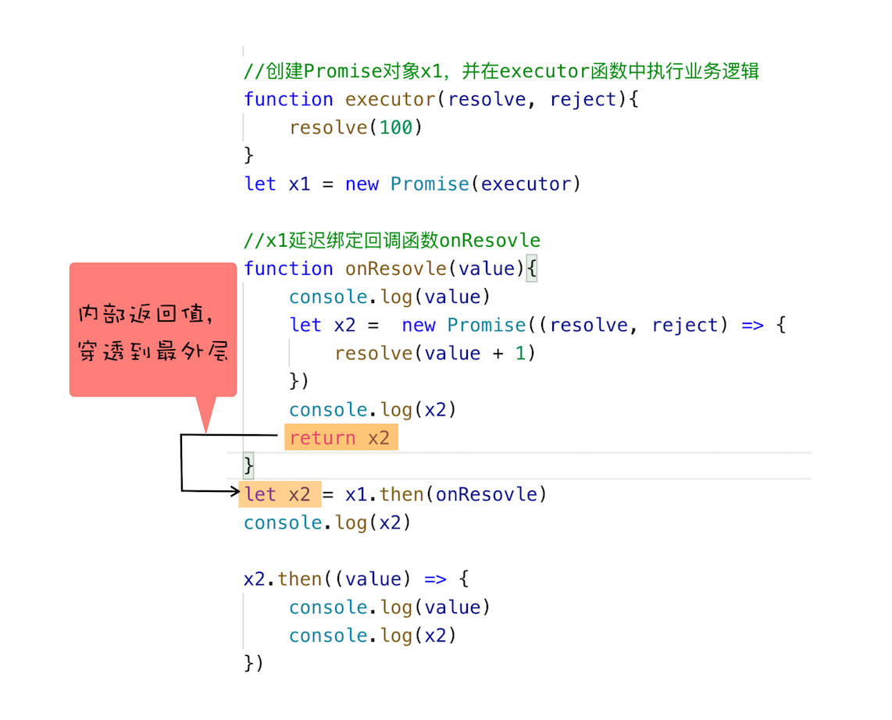

# 为什么使用 Promise

## 异步回调

JS 的异步编程模型如下，把耗时任务放在主线程之外的进程或线程中执行，避免长期霸占页面主线程。


### 第一版

由于 JS 的单线程架构，决定了需要使用异步回调处理任务，对于一个下载需求，使用 XMLHttpRequest 实现如下：

```js
function onResolve(response) {
  console.log(response);
}
function onReject(error) {
  console.log(error);
}
let xhr = new XMLHttpRequest();
xhr.ontimeout = function (e) {
  onReject(e);
};
xhr.onerror = function (e) {
  onReject(e);
};
xhr.onreadystatechange = function () {
  onResolve(xhr.response);
};
let URL = "https://www.google.com";
xhr.open("Get", URL, true);
xhr.timeout = 3000;
xhr.responseType = "text";
xhr.send();
```

> 问题：五次回调，逻辑不连贯

### 第二版：封装异步代码

只关注输入和输出：

```js
function onResolve(response) {
  console.log(response);
}
function onReject(error) {
  console.log(error);
}
function makeRequest(url) {
  let request = {
    method: "Get",
    url: url,
    headers: "",
    body: "",
    credentials: false,
    async: true,
    responseType: "text",
    referrer: "",
  };
  return request;
}
function XFetch(request, resolve, reject) {
  let xhr = new XMLHttpRequest();
  xhr.ontimeout = function (e) {
    reject(e);
  };
  xhr.onerror = function (e) {
    reject(e);
  };
  xhr.onreadystatechange = function () {
    if (xhr.status === 200) {
      resolve(xhr.response);
    }
  };
  xhr.open(request.method, URL, request.async);
  xhr.timeout = request.timeout;
  xhr.responseType = request.responseType;
  xhr.send();
}
// 调用
XFetch(makeRequest("https://www.google.com"), onResolve, onReject);
```

> 问题：
>
> 1. 任务依赖时，嵌套调用，代码可读性差
> 2. 任务的不确定性，每个任务都有两种结果，嵌套任务中的每个任务都需要判断两次，造成代码混乱

## Promise

Promise 要解决的问题就是：

1. 放弃嵌套调用模式
2. 合并多个任务的错误处理

### 解决嵌套问题

首先，延迟绑定回调函数。

```js
//创建Promise对象x1，并在executor函数中执行业务逻辑
function executor(resolve, reject) {
  resolve(100);
}
let x1 = new Promise(executor);

//x1延迟绑定回调函数onResolve
function onResolve(value) {
  console.log(value);
}
x1.then(onResolve);
```

其次，将回调函数的返回值穿透到最外层。回调函数通过`then`调用，其返回值直接穿透到外层，赋值给变量。



由此，Promise 解决了嵌套问题。回调函数的延迟绑定，使得表面上不需要用层层嵌套的方式编写请求依赖，可以在外层绑定嵌套的回调函数。回调函数的返回值穿透到最外层，使依赖请求在外层就拿到上一个请求的返回值，再进行本身的请求，不需要写在所依赖的回调请求内部，也就不构成嵌套了。

### 合并异常处理

Promise 对象的错误具有冒泡的特质，会一直向后传递，前面的错误都可以通过最后一个对象的`catch`来捕获。

> Promise 是如何实现冒泡的？

Promise 内部有`_resolve`和`_reject`变量保存成功和失败的回调，进入`then(resolve, reject)`方法时，判断`reject`参数是否是函数，如果是函数，就用这个回调函数处理错误，如果不是函数，有错误时抛出错误，向下传递被捕获。
