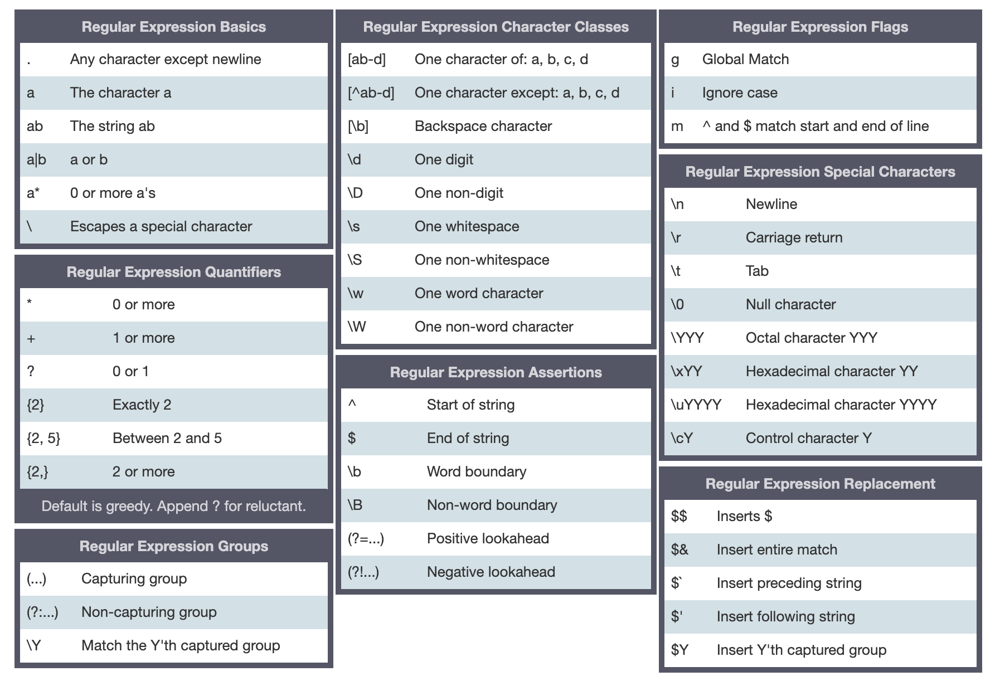

# 正则表达式

## 创建正则表达式

### 正则表达式字面量

```js
reg = /\d+/g; // 同样是 RegExp 的实例
```

优点：没有二次转义

缺点：子内容无法重复使用，过长正则可读性差

### RegExp 构造函数

```js
const alphabet = "[a-z]";
const reg = new RegExp(`${alphabet}\\d+${alphabet}`, "g");
```

优点：子内容可以重复使用

缺点：需要手动二次转义

## API

1. `RegExp.prototype.test(string)`, return true or false
2. `RegExp.prototype.source`, return 字面量内容
3. `RegExp.prototype.flags`, return (string)flags
4. `RegExp.prototype.exec(string)`, return 匹配结果 or null
5. `RegExp.prototype.lastIndex`, return 最后一次匹配成功的结束位置，也就是下一次匹配的开始位置
6. `String.prototype.match(reg)`, return 匹配结果(匹配一个值则和 reg.exec 结果相同，匹配多个值会返回匹配结果的数组)，or null。最好使用 reg.exec，结果格式固定.
7. `String.prototype.replace(reg, replaceString)`, return 替换后的结果。不像 reg.exec 需要循环才能匹配完，这个 API 会把所有匹配的值都替换掉。
8. `String.prototype.search(reg)`, return 首个匹配值的 index
9. `String.prototype.split(reg)`, return 数组

```js
const reg = /a/g;
reg.test("aba"); // true
reg.source; // "a"
reg.flags; // "g"
reg.exec("aba"); // ["a", index: 0, input: "aba", groups: undefined]
reg.lastIndex; // 1

"aba".match(reg); // ["a", "a"]
"aba".replace(reg, "c"); // "cbc"
"aba".search(reg); // 0
"aba".split(reg); // ["", "b", ""]
```

## cheatsheet



## 匹配数值

```js
reg = /[0-9]+/;
```

缺点：

存在误判，`/[0-9]+/.test("a1") === true`

```js
reg = /^\d+$/;
```

缺点：

- 不能匹配带符号的数
- 不能匹配小数

```js
reg = /^[+-]?\d+(\.\d+)?$/;
```

缺点：

- 不能匹配无整数部分的小数，如`.123`
- `()`创建了一个捕获组，会带来额外开销

```js
reg = /^[+-]?(?:\d*\.)?\d+$/; // (?:) 创建一个非捕获组
```

缺点：

- 不能匹配无小数部分的数值，如`2.`
- 不能匹配科学技术法

最终版：

```js
reg = /^[+-]?(?:\d+\.?|\d*\.\d+)?(?:e[+-]?\d+)?$/i; // i忽略大小写
```

### 数值解析

```js
execNumberList("1.0px .2px -3px +4e1px"); // [1, 0.2, -3, 40]
execNumberList("+1.0px -0.2px 3e-1px"); // [1, -0.2, 0.3]
execNumberList("1px 0"); // [1, 0]
execNumberList("-1e+1px"); // [-10]
```

```js
function execNumberList(str) {
  const reg = /[+-]?(?:\d*\.)?\d+(?:e[+-]?\d+)?(?=px|\s|$)/gi;
  let exec = reg.exec(str);
  const result = [];
  while (exec) {
    result.push(parseFloat(exec[0]));
    exec = reg.exec(str);
  }
  return result;
}
```

### 数值转货币格式

```js
formatCurrency("1"); // 1
formatCurrency("123"); // 123
formatCurrency("123456789"); // 123,456,789
```

```js
function formatCurrency(str) {
  const reg = /(\d)(?=(?:\d{3})+(?:,|$))/g;
  return str.replace(reg, "$1,");
}
function formatCurrency(str) {
  const reg = /\d(?=(?:\d{3})+(?:,|$))/g;
  return str.replace(reg, "$&,");
}
```

## 匹配颜色

### 16 进制

```js
// #rrggbb
// #rrggbbaa
// #rgb
// #rgba
const hex = "[0-9a-fA-F]";
const reg = new RegExp(`^(?:#${hex}{6}|#${hax}{8}|#${hax}{3,4})$`);
```

### rgb/rgba 表示法

```js
// rgb(r, g, b)
// rgb(r%, g%, b%)
// rgba(r, g, b, a)
// rgba(r%, g%, b%, a%)
// rgba(r, g, b, a%)
// rgba(r%, g%, b%, a)
const num = "[+-]?(?:\\d*\\.)?\\d+(?:e[+-]?\\d+)?";
const comma = "\\s*,\\s*";
const reg = new RegExp(
  `rgba?\\(\\s*${num}(%?)(?:${comma}{num}\\1){2}(?:${comma}{num}%?)?\\)`,
  "i"
);
```

## 匹配 URL

### 解析 URL

RFC 的 URL 规范是：`scheme ":" hier-part [ "?" query ] [ "#" fragment ]`

```js
console.log(execURL('https://www.google.com'));
{
  protocol: 'http:',
  host: 'www.google.com',
  hostname: 'www.google.com',
  port: '',
  pathname: '',
  search: '',
  hash: ''
}
console.log(execURL('http://localhost:8080/?#'));
{
  protocol: 'http:',
  host: 'localhost:8080',
  hostname: 'localhost',
  port: '8080',
  pathname: '/',
  search: '?',
  hash: '#'
}
console.log(execURL('https://image.so.com/view?q=360&src=srp#id=9e17bd&sn=0'));
{
  protocol: 'https:',
  host: 'image.so.com',
  hostname: 'image.so.com',
  port: '',
  pathname: '/view',
  search: '?q=360&src=srp',
  hash: '#id=9e17bd&sn=0'
}
console.log(execURL('this is not a url'));
{
  protocol: '',
  host: '',
  hostname: '',
  port: '',
  pathname: '',
  search: '',
  hash: ''
}

const protocol = '(?<protocol>https?:)';
const host = '(?<host>(?<hostname>[^/#?:]+)(?::(?<port>\\d+))?)';
const path = '(?<pathname>(?:\\/[^/#?]+)*\\/?)';
const search = '(?<search>(?:\\?[^#]*)?)';
const hash = '(?<hash>(?:#.*)?)';
const reg = new RegExp(`^${protocol}\/\/${host}${path}${search}${hash}$`);
function execURL(url) {
    const result = reg.exec(url);
    if (result) {
        result.groups.port = result.groups.port || '';
        return result.groups;
    }
    return {
        protocol: '', host: '', hostname: '', port: '',
        pathname: '', search: '', hash: '',
    };
}
```

### 解析 query 和 hash

```js
console.log(execUrlParams("#")); // { }
console.log(execUrlParams("##")); // { '#': '' }
console.log(execUrlParams("?q=360&src=srp")); // { q: '360', src: 'srp' }
console.log(execUrlParams("test=a=b=c&&==&a=")); // { test: 'a=b=c', '': '=', a: '' }

function execUrlParams(str) {
  str = str.replace(/^[#?&]/, "");
  const result = {};
  if (!str) {
    return result;
  }
  const reg = /(?:^|&)([^&=]*)=?([^&]*?)(?=&|$)/y; // 连续匹配
  let exec = reg.exec(str);
  while (exec) {
    result[exec[1]] = exec[2];
    exec = reg.exec(str);
  }
  return result;
}
```
