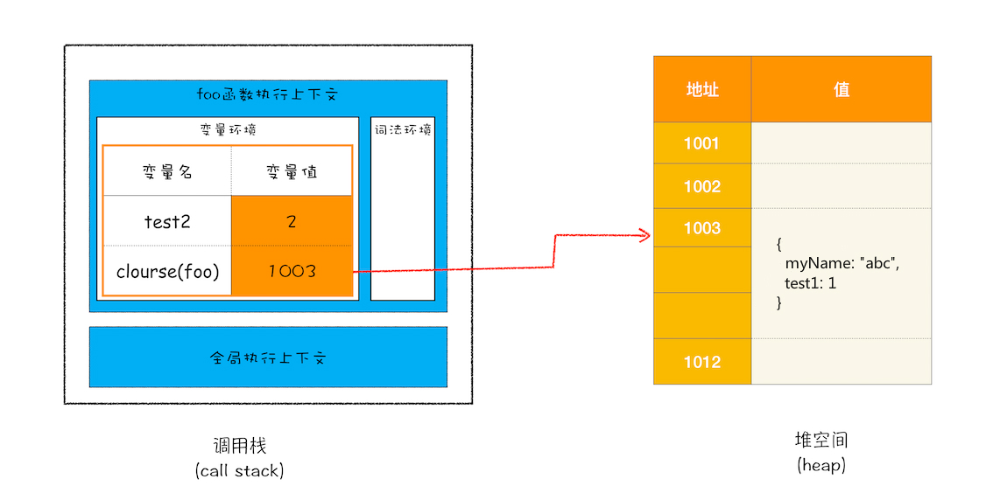

# V8 的内存机制

## 内存的分配

### JS 的数据类型

JavaScript 是一种弱类型的、动态的语言。

- 弱类型，意味着不需要告诉 JavaScript 引擎变量是什么数据类型，JavaScript 引擎在运行代码的时候自己会计算出来。也就是会做**隐式类型转换**。
- 动态，意味着可以使用同一个变量保存不同类型的数据。

JS 的数据类型分为原始类型和引用类型。这两种类型在内存中存储在不同的位置。

### 栈空间和堆空间

在 JavaScript 的执行过程中， 主要有三种类型内存空间，分别是**代码空间**、**栈空间**和**堆空间**。

- 代码空间是用来存储可执行代码的。
- 栈空间存放了执行上下文，执行上下文中的变量在被赋值为**原始类型**时，会压入栈中。
- 对于执行上下文中变量被赋值为**引用类型**时，**对象会存入堆空间中**，堆空间对应的引用地址会被压入栈中。

> 为什么不把引用类型也放入栈空间呢？
>
> V8 利用栈空间维护执行上下文，栈空间太大，会影响执行上下文的切换效率。

所以通常情况下，栈空间都不会设置太大，主要用来存放一些原始类型的小数据。而引用类型的数据占用的空间都比较大，所以这一类数据会被存放到堆中，堆空间很大，能存放很多大的数据，不过缺点是分配内存和回收内存都会占用一定的时间。

**原始类型的赋值会完整复制变量值，而引用类型的赋值是复制引用地址。**

### 闭包如何存储

```js
function foo() {
  var myName = "abc";
  let test1 = 1;
  const test2 = 2;
  var innerBar = {
    setName: function(newName) {
      myName = newName;
    },
    getName: function() {
      console.log(test1);
      return myName;
    }
  };
  return innerBar;
}
var bar = foo();
bar.setName("def");
bar.getName();
console.log(bar.getName());
```

从内存角度分析这段代码：

1. 首先是编译，并创建一个空执行上下文。
2. 在编译过程中，遇到内部函数，还要对内部函数做一次快速的**词法扫描**，发现该内部函数引用了 foo 函数中的 myName 变量，**由于是内部函数引用了外部函数的变量**，所以 V8 判断这是一个**闭包**，于是在**堆空间**创建一个`closure(foo)`的对象（这是一个内部对象，JavaScript 是无法访问的），用来保存 myName 变量。
3. 接着继续扫描到 getName 方法时，发现该函数内部还引用变量 test1，于是 V8 又将 test1 添加到`closure(foo)`对象中。这时候堆中的`closure(foo)`对象中就包含了 myName 和 test1 两个变量了。
4. 由于 test2 并没有被内部函数引用，所以 test2 依然保存在调用栈中。



可以看出，在执行到 foo 函数时，闭包就产生了；当 foo 函数执行结束之后，返回的 getName 和 setName 方法都引用`closure(foo)`对象。所以即使 foo 函数的执行上下文被销毁了，foo 函数中的对`closure(foo)`的引用也断开了，但是`closure(foo)`依然被其内部的 getName 和 setName 方法引用。所以在下次调用`bar.setName`或者`bar.getName`时，创建的执行上下文中就包含了`closure(foo)`。只有当 bar 被销毁时，闭包对象才会被回收。

总的来说，产生闭包的核心有两步：

1. 需要预扫描内部函数
2. 把内部函数引用的外部变量保存到堆中

## 垃圾回收机制

JS 产生的垃圾数据是由垃圾回收器来释放的，并不强制使用手动通过代码来释放。因为 V8 的内存分为栈空间和堆空间，下面关注这两种内存空间的垃圾回收机制。

### 如何回收调用栈中的数据

JavaScript 引擎会通过向下移动 ESP 来销毁该函数保存在栈中的执行上下文。

```js
function foo() {
  var a = 1;
  var b = { name: "abc" };
  function showName() {
    var c = "def";
    var d = { name: "mn" };
  }
  showName();
}
foo();
```

V8 执行时，在调用栈里有一个记录当前执行状态的指针（称为 ESP），会指向当前的执行上下文。`showName()`执行结束后，ESP 会下移到`foo`函数的执行上下文，这个下移操作就销毁了`showName`函数的执行上下文。


### 如何回收堆空间中的数据

上面的例子里，当`foo`函数的执行上下文也被销毁，变量跟着被销毁，但是 b 和 d 的引用地址指向的对象仍然保存在堆空间中。此时就需要垃圾回收器了。

#### 堆空间的内存

64 位系统是 1.4GB，新生代 64MB，老生代 1400MB。因为前端实践中 JS 通常不持续，执行完就会直接释放内存，所以 1.4GB 是够用的。

**新生代中存放的是生存时间短的对象，老生代中存放的生存时间久的对象。**这两个区域使用了不同的垃圾回收器。

- 副垃圾回收器，主要负责新生代的垃圾回收。
- 主垃圾回收器，主要负责老生代的垃圾回收。


#### 回收过程

两种回收器的回收流程是相似的：

1. 标记空间中还在使用的对象（活动对象），和可以进行垃圾回收的对象（非活动对象）。
2. 统一清理内存中所有被标记为可回收的对象。
3. 做内存整理。频繁回收对象后，内存中就会存在大量不连续空间（内存碎片），内存碎片过多的话，需要分配较大连续内存的时候，就可能出现内存不足的情况。

JS 在回收时，会暂停当前的执行程序，所以在回收大内存变量时，容易造成卡顿。

##### 新生代回收：复制

回收非常频繁，采用 Scavenge 算法，用空间换时间。

在新生代中，当 From 里的空间占用超过 25%，就会将仍然存活的对象复制到 To 里，再将当前的 From 清空，即释放无用的对象。这就是一次垃圾回收。下一次再从 To 复制到 From 里，如果经过两次垃圾回收后还存活的对象，会转移到老生代中。

##### 老生代回收：标记-删除-整理

1. 根据 ESP 的位置，遍历调用栈，查找变量的引用地址在堆空间的位置，将这样的对象标记为活动对象。遍历完没有被标记的，就被判为垃圾数据。
2. 清除垃圾数据。
3. 老生代空间变得不连续，有许多碎片空间，需要整理出连续空间。假设白色部分是活动对象占用的空间，整理的过程就是将活动对象往一端移动。


##### 新-老转移


#### 全停顿

由于 JavaScript 是运行在主线程之上的，一旦执行垃圾回收算法，就需要将正在执行的 JavaScript 脚本暂停下来，待垃圾回收完毕后再恢复脚本执行。


在 V8 新生代的垃圾回收中，因其空间较小，且存活对象较少，所以全停顿的影响不大。对于老生代执行垃圾回收时，占用主线程时间过久，将会造成页面的卡顿现象。

为了降低老生代的垃圾回收而造成的卡顿，V8 将标记过程分为一个个的子标记过程，同时让垃圾回收标记和 JavaScript 应用逻辑交替进行，直到标记阶段完成，这就是增量标记算法。使用增量标记算法，可以把一个完整的垃圾回收任务拆分为很多小的任务，这些小的任务执行时间比较短，可以穿插在其他的 JavaScript 任务中间执行，就不会让用户因为垃圾回收任务而感受到页面的卡顿了。


### 如何查看 JS 引擎内存

#### 浏览器：`window.performance.memory`


#### node： `process.memoryUsage()`


`external`：node 底层由 C++ 完成，可以扩展内存，这一点浏览器是没有的。

#### 示例

```js
const format = function(bytes) {
  return (bytes / 1024 / 1024).toFixed(2) + "MB";
};

const print = function() {
  const memo = process.memoryUsage();
  console.log(
    `heapTotal: ${format(memo.heapTotal)}, heapUsed: ${format(memo.heapUsed)}`
  );
};

function local() {
  let localArr = [];
  for (let index = 0; index < 5; index++) {
    localArr.push(new Array(20 * 1024 * 1024));
    print();
  }
}

local();

let globalArr = [];
setInterval(() => {
  globalArr.push(new Array(20 * 1024 * 1024));
  print();
}, 100);
```


### 如何避免内存使用不当

#### 避免滥用全局变量

尽量使用局部变量，可以使用闭包函数，或转为立即自执行函数。

```js
let user = (function() {
  let _name = "Tim",
    _age = 22;
  return {
    getUserInfo: function() {
      return _name + ": " + _age;
    }
  };
})();
```

在不得不使用全局变量的情况下，需要及时手动释放，赋值为`undefined`或`null`.

#### 限制缓存

缓存大部分情况都是全局变量，可以为缓存加锁，释放长期未用的缓存内容。

#### 特殊处理大文件

##### 前端大文件上传

可以采用切片上传，`file.slice()`

##### node 大文件读取

避免使用`fs.readFile(filename)`，这个 API 是一次性把文件读取到 buffer 中。

使用`fs.createReadStream(filename).pipe()`，转为流式读取。
