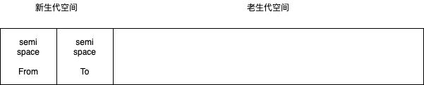
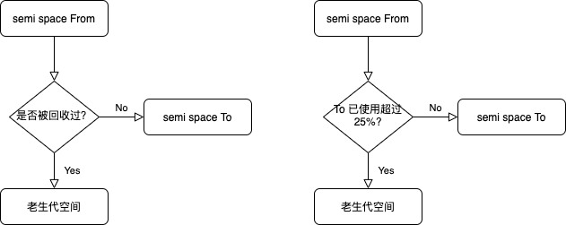
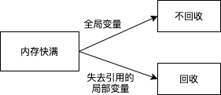
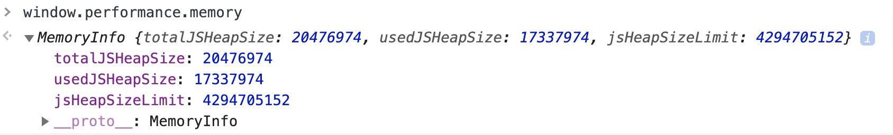
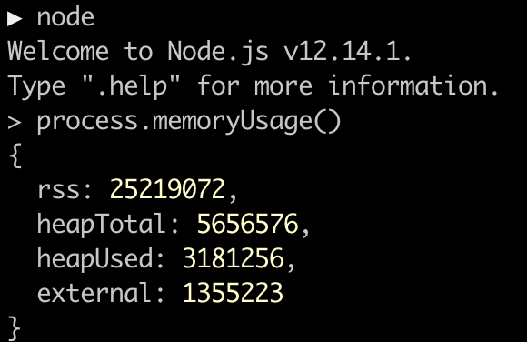
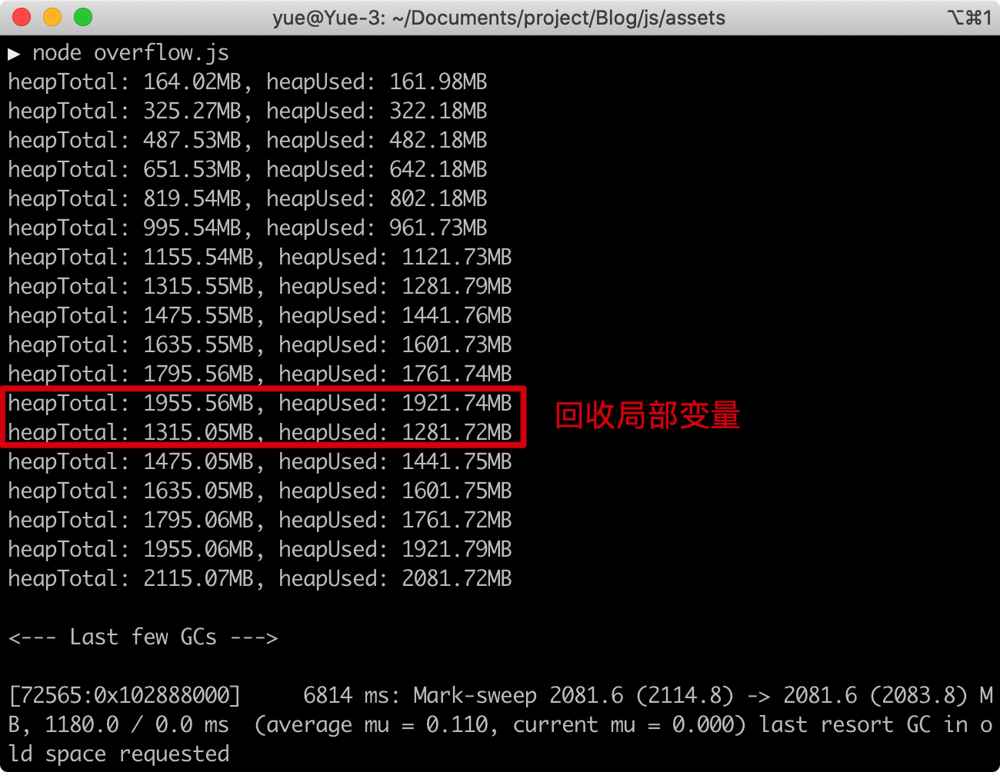

# v8 垃圾回收机制

## 关注内存

1. 页面内存占用过大，会引起卡顿，页面无响应
2. node 写后端时，需要持久性服务，内存可能会溢出

## 内存大小

64 位系统是 1.4GB，新生代 64MB，老生代 1400MB。

因为前端实践中 JS 通常不持续，执行完就会直接释放内存，所以 1.4GB 是够用的。



## 回收过程

JS 在回收时，会暂停当前的执行程序，所以在回收大内存变量时，容易造成卡顿。

### 新生代回收：复制

回收非常频繁，采用 Scavenge 算法，典型的用空间换时间算法思路。

在新生代中，当 From 里的空间占用超过 25%，就会将仍然存活的变量复制到 To 里，再将当前的 From 清空，即释放无用的变量。下一次再从 To 复制到 From 里，如果来回 copy 后还有存活的变量，会转移到老生代中。

### 老生代回收：标记-删除-整理

老生代会标注已死亡的变量，删除这些变量后，老生代空间会变得不连续，有许多碎片空间，需要整理出连续空间。要把黑色这些删除的空间，全部移到末尾，形成整块的未用空间。这样做的原因是，JS 中 array 是需要连续内存空间的，没有整块空间，会导致 array 无法转移到老生代空间。


### 新-老转移



## 如何判断是否回收？

变量可以笼统地分为全局变量和局部变量。



关于**闭包**内的变量是否会被回收需要时情况而定：

- 当闭包函数内的变量在外部没有被引用，闭包函数执行结束后，就可以回收。
- 闭包函数返回的变量被外部全局变量引用时，或被未失效的局部变量引用，就不会被回收。

## 查看内存

### 浏览器：`window.performance.memory`



### node： `process.memoryUsage()`



`external`：node 底层由 C++ 完成，可以扩展内存，这一点浏览器是没有的。

### 示例

```js
const format = function(bytes) {
  return (bytes / 1024 / 1024).toFixed(2) + "MB";
};

const print = function() {
  const memo = process.memoryUsage();
  console.log(
    `heapTotal: ${format(memo.heapTotal)}, heapUsed: ${format(memo.heapUsed)}`
  );
};

function local() {
  let localArr = [];
  for (let index = 0; index < 5; index++) {
    localArr.push(new Array(20 * 1024 * 1024));
    print();
  }
}

local();

let globalArr = [];
setInterval(() => {
  globalArr.push(new Array(20 * 1024 * 1024));
  print();
}, 100);
```



## 如何避免内存使用不当

### 避免滥用全局变量

尽量使用局部变量，可以使用闭包函数，可以转为立即自执行函数。

在不得不使用全局变量的情况下，需要及时手动释放，赋值为`undefined`或`null`.

### 限制缓存

缓存大部分情况都是全局变量，可以为缓存加锁，释放长期未用的缓存内容。

### 特殊处理大文件

#### 前端大文件上传

可以采用切片上传，`file.slice()`

#### node 大文件读取

避免使用`fs.readFile(filename)`，这个 API 是一次性把文件读取到 buffer 中。

使用`fs.createReadStream(filename).pipe()`，转为流式读取。
