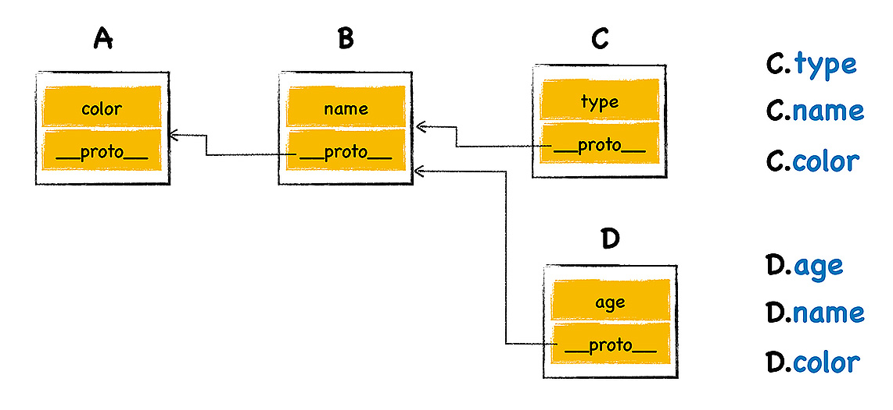
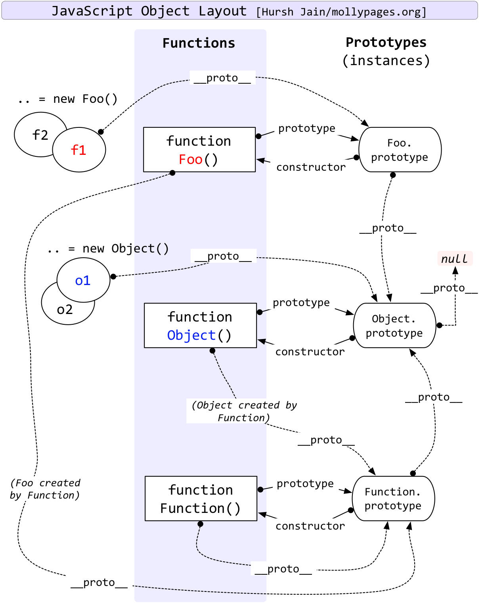

# V8 如何实现对象继承

## 原型继承

继承是一个对象可以访问另外一个对象中的属性和方法，JS 不是基于类的设计，是基于原型继承的设计。



V8 中每个 JS 对象有个隐藏属性`__proto__`，指向内存中这个对象的原型对象，沿着原型对象一级一级得找属性，就是查找路径就是**原型链**。JS 就是通过原型和原型链来实现继承的。

## 构造函数创建对象

在开发中，不应直接对隐藏属性`__proto__`做修改操作，而是通过构造函数设置其原型对象。

```js
function DogFactory(type, color) {
  this.type = type;
  this.color = color;
}
var dog = new DogFactory("Dog", "Black");
```

在用`new`关键字调用构造函数时，V8 做了下面的事：

```js
var dog = {};
dog.__proto__ = DogFactory.prototype;
DogFactory.apply(dog, arguments);
```

## 构造函数如何继承

函数是特殊的对象，在 V8 中除了有`code`和`name`两个隐藏属性外，还有一个隐藏属性`prototype`。

`new`关键字创建的对象，其`__proto__`指向构造函数的`prototype`属性，那么，构造函数`prototype`属性里的函数方法，新创建的对象都拥有了，这就实现了继承。



> [JS 中的对象](/js/OOP.md)写了创建对象和对象继承的多种方法，及发展过程。
