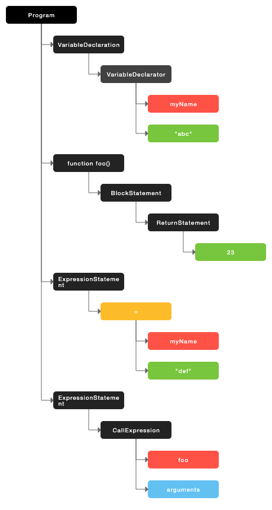
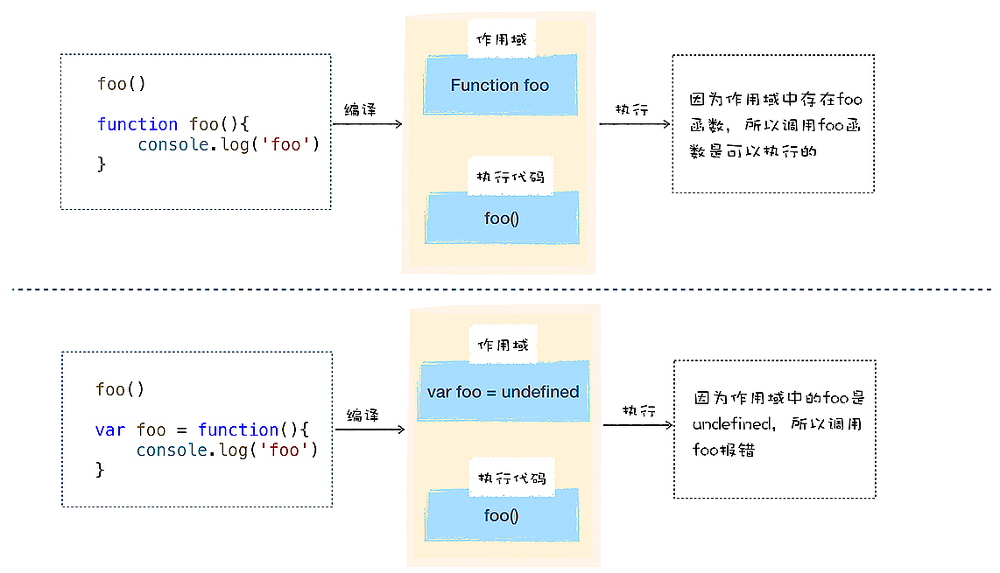
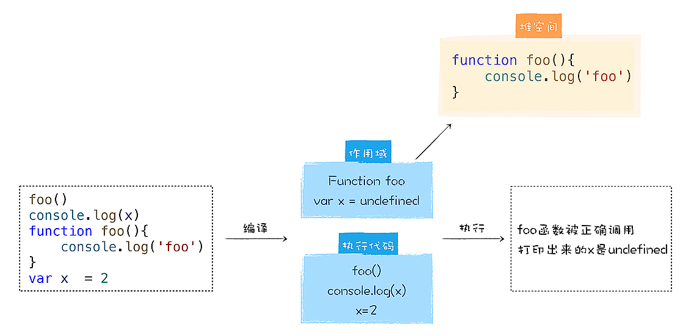
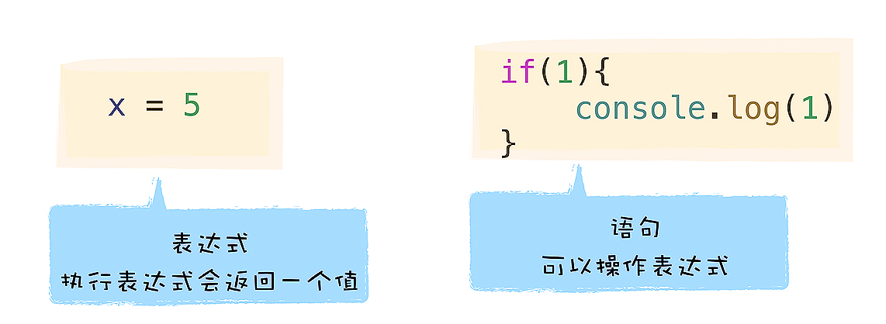
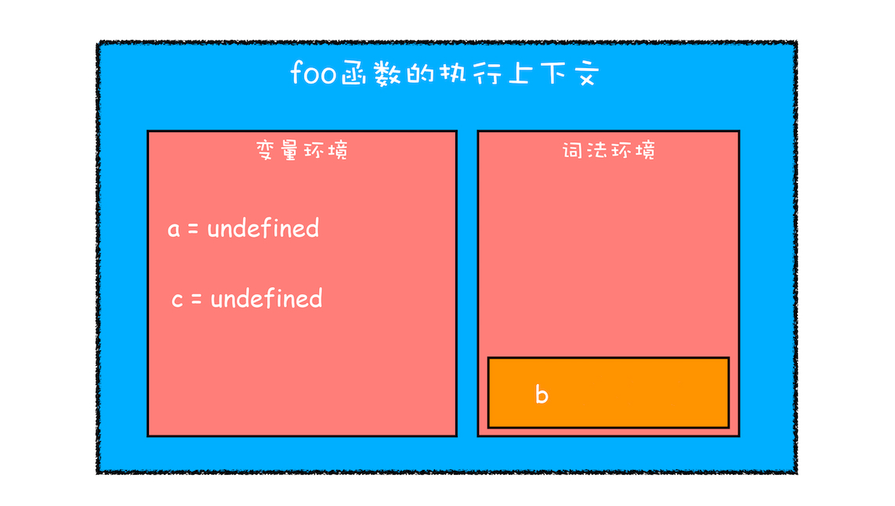
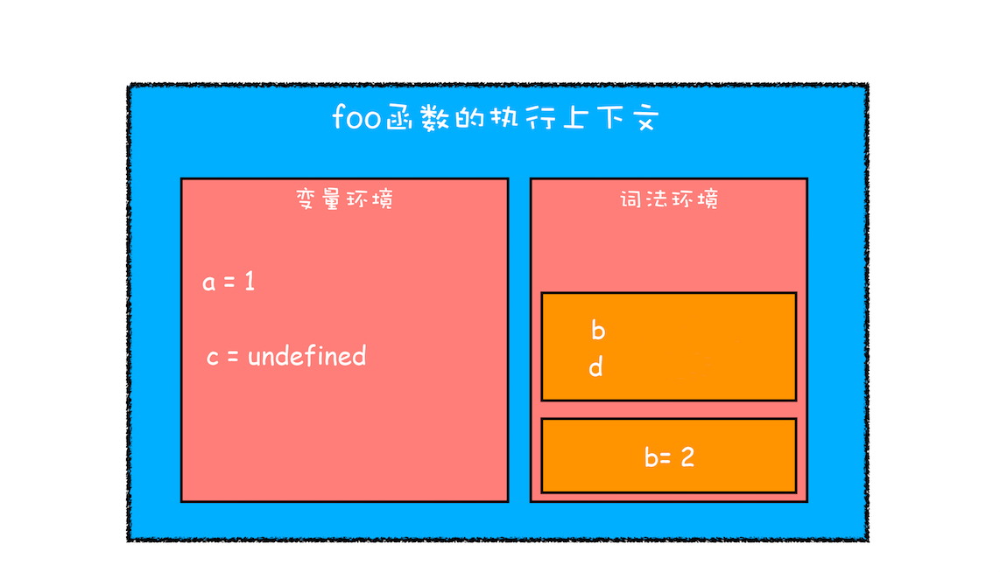
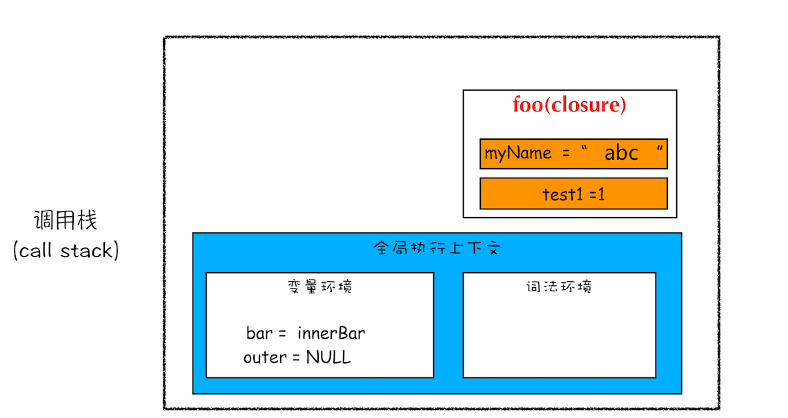
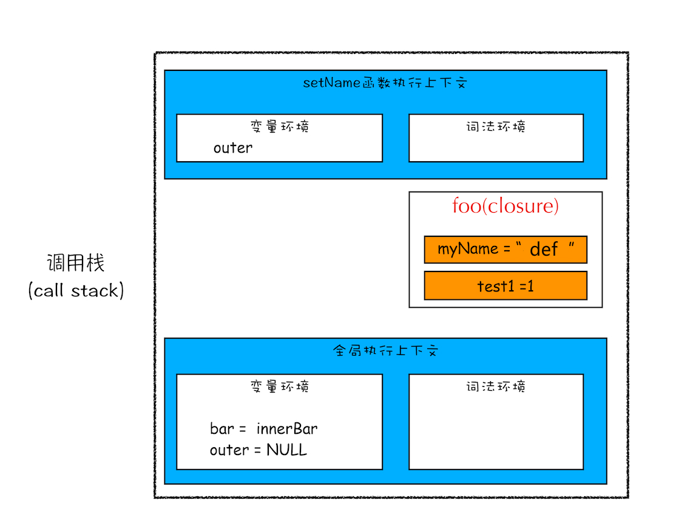

# V8 如何执行 JS 代码

## 概述


V8 在启动执行前会初始化运行环境：

- 栈和栈空间：V8 内存使用栈来管理
- 全局执行上下文：全局变量，内置函数等
- 全局作用域：全局变量，执行过程中的数据需要放到内存中
- 事件循环机制：消息驱动器和消息队列

### AST

V8 接收到源代码时，将代码视为字符串，需要将其结构化为 AST，生成 AST 的同时会生成作用域。

```js
var myName = "abc";
function foo() {
  return 23;
}
myName = "def";
foo();
```

生成 AST 分为两个过程：

- 第一阶段是词法分析，将一行行的源码拆解成一个个 token。
- 第二阶段是语法分析，将上一步生成的 token 数据，根据语法规则转为 AST。

在[这个网站](http://resources.jointjs.com/demos/javascript-ast)中可以生成 AST，这段代码生成的 AST 如下：



> Babel 的原理是把 ES6 代码转为 AST，再将 ES6 的 AST 转成 ES5 的 AST，最后利用 ES5 的 AST 得到 JavaScript 代码。

### 字节码

字节码介于 AST 和机器代码之间，可以通过解释器解释执行，或者通过编译器转化成机器代码得出结果。机器码所占用的空间远远超过了字节码，使用字节码可以减少系统的内存使用。

### 标记热点代码

在解释执行代码的过程中，当有代码段被重复多次执行，则会被标记成热点代码，由编译器编译成二进制机器代码，保存在内存中。以后再执行这段代码时，就会直接执行二进制代码。


## JS 中的函数

函数在 JS 中是一等公民，即可以赋值给变量，可以作为参数，可以作为函数返回值。函数是一个特殊的对象，在创建函数后，V8 给函数两个隐藏属性，`name`和`code`，`code`把代码存储为字符串，V8 调用时，就是执行`code`中的内容。

由于函数一等公民的特点，一个函数可以引用外部变量，这就形成了闭包，尽管外层函数执行结束后，其内部变量应当被销毁，但是被其他函数引用的变量会保存在内存中不被销毁。

## 函数表达式与函数声明



**V8 编译阶段**，会分析代码中的语句，也就是变量定义和函数声明，V8 会把它们放入内存。V8 将普通变量的值初始化为 undefined，声明的函数变量指向对应的函数对象，将函数对象保存在内存的栈空间中。所以在执行前，这些变量就已经被初始化在作用域中，这个过程就是**变量提升**。

**V8 执行阶段**，才会执行表达式。在图例中，下方在函数表达式执行前就调用函数，显然那时 foo 还是 undefined，函数对象还不在内存中，无法被调用。在执行阶段，会对之前定义的普通变量做赋值操作。



> 表达式和语句的区别：
>
> 

函数表达式与函数声明的区别在于：

- 函数表达式在表达式语句中使用 function，将函数对象赋值给变量
- 在函数表达式中，可以省略函数名称，从而创建匿名函数
- 一个函数表达式可以被用作一个立即执行函数表达式：IIFE

### IIFE

JS 中圆括号内可以放表达式，整个语句也是一个表达式，有返回值。同理，在圆括号内定义一个函数，V8 会把它看成函数表达式，同时会返回这个函数对象。在圆括号后加调用括号，就是立即执行函数 IIFE。IIFE 函数和其内部变量不会被外界访问，在 IIFE 执行完成后，会销毁内部定义的变量，保护了全局环境。

```js
var n = 1;
(function foo() {
  n = 100;
  console.log(n);
})();
console.log(n);
// 100, 100
```

```js
var n = 1;
function foo() {
  n = 100;
  console.log(n);
}
console.log(n);
foo();
// 1, 100
```

## 执行上下文与调用栈

### 执行上下文

V8 引擎在编译时，会创建全局执行上下文，执行过程中调用函数时，会为函数创建函数执行上下文。

- 当 JavaScript 执行全局代码的时候，会编译全局代码并创建**全局执行上下文**，而且在整个页面的生存周期内，全局执行上下文只有一份。
- 当调用一个函数的时候，函数体内的代码会被编译，并创建**函数执行上下文**，一般情况下，函数执行结束之后，创建的函数执行上下文会被销毁。
- 当使用 eval 函数的时候，eval 的代码也会被编译，并创建执行上下文。

> 在函数中没有声明的变量，会在全局执行上下文中，保存在全局变量中。所以，函数中的变量需要用`let`, `const`声明。

### 调用栈

JavaScript 中一个函数会调用另外一个函数，调用栈就是用来管理函数调用关系的一种数据结构。调用栈是 V8 追踪函数执行的一个机制，当一次有多个函数被调用时，通过调用栈就能够追踪到哪个函数正在被执行以及各函数之间的调用关系。

调用栈是有大小的，当执行上下文超过一定数目后，会造成**栈溢出**。在递归时，要注意终止条件，当出现栈溢出的情况，需要改写成循环的形式，或者加入定时器把当前任务拆分为其他很多小任务。

## 作用域、作用域链、闭包

### 作用域

作用域就是**变量与函数的可访问范围**，控制着变量和函数的**可见性**和**生命周期**。在 ES6 之前，只有全局作用域和函数作用域。

- **全局作用域**中的对象在代码中的任何地方都能访问，其生命周期伴随着页面的生命周期。
- **函数作用域**就是在函数内部定义的变量或者函数，且它们只能在函数内部被访问。函数执行结束之后，函数内部定义的变量会被销毁。

为了方便使用，JS 引入变量提升机制。也就是，在编译阶段，将定义的变量和函数存入作用域中，执行阶段再一行一行执行代码。带来的问题有：1. 变量容易被覆盖 2. 变量用后没有及时被销毁。为了解决这两个问题，ES6 引入了块级作用域。引入`let`和`const`关键字，块作用域内声明的变量不会影响外部变量，函数块运行结束后，块作用域内的变量会自动被销毁。

> V8 是如何支持块级作用域的呢？
>
> 从创建执行上下文的角度来看，在**编译阶段**，用`var`声明的变量，会被放入变量环境中，并且函数内部的变量可以超越函数块，放入变量环境里。而`let`和`const`声明的变量放入词法环境中，且函数内部的变量暂时不会放入词法环境。例如：

```js
function foo() {
  var a = 1;
  let b = 2;
  {
    let b = 3;
    var c = 4;
    let d = 5;
    console.log(a);
    console.log(b);
  }
  console.log(b);
  console.log(c);
  console.log(d);
}
foo();
```

**第一步是编译并创建执行上下文**。

- 函数内部通过`var`声明的变量，在编译阶段全都被存放到变量环境里面，且**初始化为 undefined**。
- 通过`let`声明的变量，在编译阶段会被存放到词法环境中，**不会被初始化**。
- 在函数的作用域内部，通过`let`声明的变量并没有被存放到词法环境中。



**第二步继续执行代码**。

- 当执行到代码块里面时，变量环境中 a 的值已经被设置成了 1，词法环境中 b 的值已经被设置成了 2。
- 代码块内部通过`let`声明的变量 b, d 被放到词法环境中。这里并没有**编译过程**，变量是被追加到词法环境中，当这个块执行结束之后，它们会被销毁掉。这里的变量 b 和外部的 b 是相互独立，互不影响的。
- 在词法环境内部，同样维护了一个小型栈结构。



**第三步继续执行块作用域。**

- 首先是 b,c,d 的赋值，接着到块作用域中的`console.log(a)`时，需要在词法环境和变量环境中查找变量 a 的值。
- 查找方式变量的方式：沿着词法环境的栈顶向下查询，如果在词法环境中的某个块中查找到了，就直接返回给 V8，如果没有查找到，那么继续在变量环境中查找。


**最后一步跳出块级作用域**。

- 当块作用域执行结束之后，其内部定义的变量就会从词法环境的栈顶弹出。


下面做一个变量提升的总结：

- `var`声明的变量，在编译阶段会被创建，且初始化为 undefined 存储在变量环境中，**执行阶段赋值**。
- `let`和`const`声明的变量，在块作用域创建时被创建存储在词法环境，但没有被初始化，所以在赋值操作前引用该变量，会出现“暂时性死区”的错误。
- `function`声明的变量，在编译阶段创建，**赋值**为对应的函数对象，存储在变量环境中。

```js
// 可以看到这个例子中，会抛出未初始化的错误
let a = "a";
{
  console.log(a);
  let a = "b";
}
// 返回 Uncaught ReferenceError: Cannot access 'a' before initialization
```

### 作用域链

在每个执行上下文的变量环境中，都包含了一个外部引用 outer，用来指向外部的执行上下文。当一段代码使用了一个变量时，JavaScript 引擎首先会根据这个顺序查找变量：当前的执行上下文 -> outer 指向的执行上下文。这个查找链表被称为作用域链。

> 如何确定 outer 的指向呢？
>
> 答案是通过**词法作用域**。词法作用域是**代码阶段决定**好的，**和函数是怎么调用的没有关系**。由代码中函数声明的位置来决定的，通过它就能够预测代码在执行过程中如何查找标识符。


> 块级作用域是如何查找变量的呢？
>
> 与全局作用域和函数作用域相似，只是需要区分词法环境和变量环境。查找顺序：当前执行上下文的词法环境 -> 当前执行上下文的变量环境 -> outer 指向的执行上下文的词法环境 -> outer 指向的执行上下文的变量环境

### 闭包

根据词法作用域的规则，内部函数总是可以访问其外部函数中声明的变量，当通过调用一个外部函数返回一个内部函数后，即使该外部函数已经执行结束了，内部函数引用外部函数的变量依然保存在内存中，这些变量的集合称为闭包。

```js
function foo() {
  var myName = "abc";
  let test1 = 1;
  const test2 = 2;
  var innerBar = {
    getName: function () {
      console.log(test1);
      return myName;
    },
    setName: function (newName) {
      myName = newName;
    },
  };
  return innerBar;
}
var bar = foo();
bar.setName("def");
bar.getName();
console.log(bar.getName());
```

闭包的产生：



在`bar.setName("def")`时，作用的是`foo`闭包中的变量。`bar.getName()`查找变量`myName`的顺序就是：当前执行上下文 –> foo 函数闭包–> 全局执行上下文。在 Chrome 开发者工具里，表示为：Local -> Closure -> Global。



> 闭包如何回收？
>
> 如果引用闭包的函数是个局部变量，等局部变量销毁后，在下次 JavaScript 引擎执行垃圾回收时，判断闭包这块内容如果已经不再被使用了，那么 JavaScript 引擎的垃圾回收器就会回收这块内存。所以，**如果闭包会一直使用，那么它可以作为全局变量而存在；但如果使用频率不高，而且占用内存又比较大的话，那就尽量让它成为一个局部变量。**

## this


首先，this 和执行上下文绑定，每个执行上下文都有对应的 this。

### 全局执行上下文中的 this

全局执行上下文中的 this 是指向 window 对象的。这是 this 和作用域链的唯一交点，作用域链的最底端包含了 window 对象，全局执行上下文中的 this 也是指向 window 对象。

### 函数执行上下文中的 this

在默认情况下，函数中的 this 依然指向 window 对象，但可以通过以下方法设置 this 的指向。

#### 通过函数的 call/apply/bind 方法

下面这段代码中，改变了 foo 中的 this 指向 bar 对象。

```js
let bar = {
  myName: "a",
};
function foo() {
  this.myName = "b";
}
foo.call(bar);
console.log(bar);
console.log(myName);
```

#### 对象调用

- 在全局环境中调用一个函数，函数内部的 this 指向的是全局变量 window。
- 通过一个对象来调用其内部的一个方法，该方法的执行上下文中的 this 指向对象本身。

```js
var myObj = {
  showThis: function () {
    console.log(this);
  },
};
myObj.showThis(); // this 指向对象本身
```

```js
var myObj = {
  showThis: function () {
    console.log(this);
  },
};
var foo = myObj.showThis;
foo(); // this 指向 window
```

#### 构造函数设置

通过 new 关键字调用构造函数，this 会指向创建的新对象本身。

```js
function CreateObj() {
  this.name = "abc";
}
var myObj = new CreateObj(); // this 指向 myObj
```

### this 的问题

嵌套函数中的 this 无法从外层函数继承得来，这也是 ES6 引入箭头函数要解决的问题之一。下面这个例子中，`setTimeout`里的 this 指向 window，调用`updateInfo`是并没有改变`userInfo`的属性值。

```js
let userInfo = {
  name: "abc",
  age: 13,
  sex: male,
  updateInfo: function () {
    setTimeout(function () {
      this.name = "def";
      this.age = 39;
      this.sex = female;
    }, 100);
  },
};
userInfo.updateInfo();
```

ES6 的箭头函数**没有自己的执行上下文**，就不存在自身的 this，箭头函数里的 this 的值由最近一层的非箭头函数决定。下面这样的写法，就可以改变`userInfo`的属性值了。

```js
let userInfo = {
  name: "abc",
  age: 13,
  sex: male,
  updateInfo: function () {
    setTimeout(() => {
      this.name = "def";
      this.age = 39;
      this.sex = female;
    }, 100);
  },
};
userInfo.updateInfo();
```

还有一种写法，是把 this 保存到 self 变量中，利用作用域机制，传递到嵌套函数中。

```js
let userInfo = {
  name: "abc",
  age: 13,
  sex: male,
  updateInfo: function () {
    var self = this;
    setTimeout(function () {
      this.name = "pony.ma";
      this.age = 39;
      this.sex = female;
    }, 100);
  },
};
userInfo.updateInfo();
```

## 从 V8 执行角度思考 JS 性能优化

- 提升单次脚本的执行速度，避免 JavaScript 的长任务霸占主线程，使页面快速响应交互。
- 避免大的内联脚本，因为在解析 HTML 的过程中，解析和编译也会占用主线程。
- 减少 JavaScript 文件的容量，因为更小的文件会提升下载速度，并且占用更低的内存。

<!--
## V8 访问对象属性

对象的属性分为：常规属性（properties）和排序属性（elements）。常规属性是字符串属性，会根据创建顺序排序。排序属性是数字属性，会按照数字大小排序。在`for..in`打印对象属性时，会先打印排序属性，再打印常规属性。这两种属性在 V8 中都是线性结构存储，属于快属性策略存储。

对象属性过多时，V8 会采用慢属性策略存储，常用非线性结构（字典）来存储属性。

> 尽量少用`delete`来删除属性，这样会造成属性`elements`的重排，或者查找`properties`，或者在字典中查找，耗时长，直接把属性值设置成`undefined`是比较好的做法。 -->
