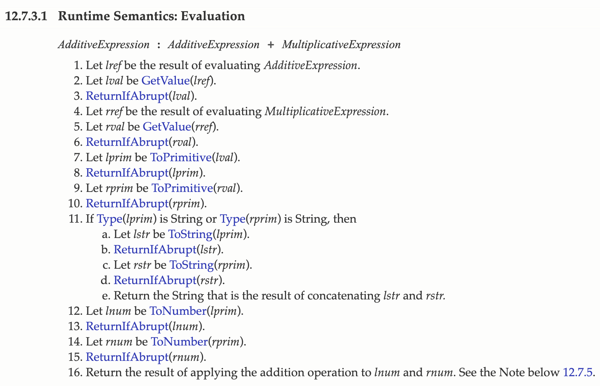

# V8 中的类型系统

JS 是弱类型语言，JS 引擎会在运行代码时做隐式类型转换。

## V8 执行加法的过程

```js
var Obj = {
  toString() {
    return "200";
  },
  valueOf() {
    return 100;
  },
};
Obj + "3";
```

V8 会按照规范进行加法操作：



图中的`toPrimitive`方法是为了将对象转换成原始类型，转换过程如下：


当两个变量都是原始类型时，V8 的规范是：**如果其中一个值的类型是字符串时，则另一个值也需要强制转换为字符串，然后做字符串的连接运算。在其他情况时，所有的值都会转换为数字类型值，然后做数字的相加**。
