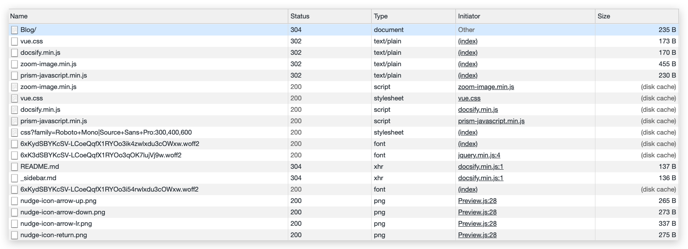

# HTTP 状态码

首先看个博客访问的请求状况。

## 304 Not Modified

与浏览器协商缓存有关，在请求头中的 If-Modified-Since(Last-Modified) 和 If-None-Match(ETag) 符合服务端条件，则表示资源未被修改，客户端可以访问缓存获取资源。相当于浏览器向服务器确认了缓存的有效性。

## 302 Found

临时重定向，服务端响应重定向地址，浏览器再次向重定向地址发送请求。

## 200 (from cache)

服务器强缓存，也就是响应头包含 Expires 或 Cache-Control 允许浏览器强缓存资源文件到本地。不需要向服务器发送请求确认，直接从缓存里拿资源。

Memory Cache 时效性短，关闭 Tab 页面后缓存被释放，读取速度快。

Disk Cache 容量大，存储时效性长，对于使用率高的文件优先存储在硬盘。

## 301 与 302

在搜索引擎方面，这两个有很大区别。301 表示旧地址资源永久被移除，搜索引擎抓取新内容的同时也将旧网址交换为重定向之后的地址。302 则表示旧地址资源仍可以访问，搜索引擎仍然会保存旧网址。302 容易被网络劫持，这个只能让搜索引擎方做判断，目前无法完全解决。

## 206 与 416

当传输 mp3/mp4 这种音频/视频资源时，常需要使用断点传输。在请求头里添加`Range: bytes=XXX`的字段，表明断点位置，请求成功返回 206，请求失败返回 416.
