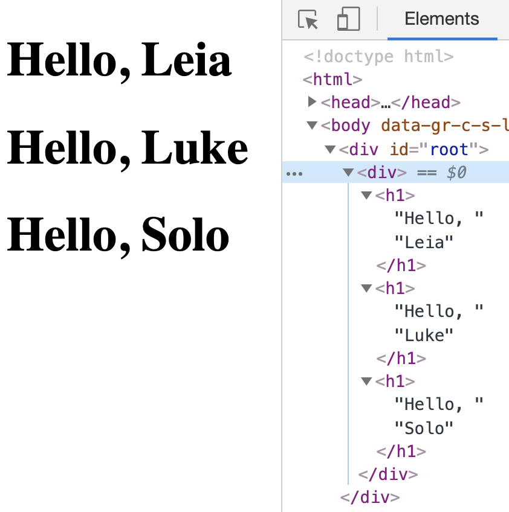
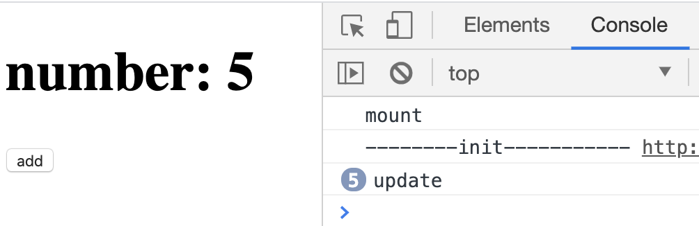

# 组件与生命周期

React 有两种组件类型：有状态组件，无状态组件。

## 无状态组件

又是函数式组件，不存在 state 和生命周期方法，只传入 props 和 context 两个参数，可以看到 Babel 里的编译：

```js
// JSX
function Welcome(props) {
  return <h1>Hello, {props.name}</h1>;
}
<Welcome name="Sara" />;
// Babel
function Welcome(props) {
  return /*#__PURE__*/ React.createElement("h1", null, "Hello, ", props.name);
}
/*#__PURE__*/
React.createElement(Welcome, {
  name: "Sara"
});
```

函数组件内部会调用`React.createElement()`返回 Virtual DOM 对象，在使用函数组件时，`React.createElement()`的第一个参数`tag`接收的是函数，在本项目中，这个方法不需要改写。

> 无状态组件的优势在于全局只有一个实例，有状态组件调用时，每次调用都会创建新的实例。单例模式，可以避免不必要的检查，同时优化内存空间。

## 有状态组件

使用 ES6 的类语法构建如下：

```js
class Welcome extends React.Component {
  render() {
    return <h1>Hello, {props.name}</h1>;
  }
}
```

首先要实现`Component`类，在类里定义其`state`, `props`, `render`, `setState`, 以及生命周期函数。

```js
import { renderComponent } from "../react-dom/render";
class Component {
  constructor(props = {}) {
    this.state = {};
    this.props = props;
  }
  // 这里是同步方法，React中是异步的
  setState(stateChange) {
    // 浅拷贝，将变化的state属性整合到this.state上
    // 同属性下，前者的值会被后者覆盖
    Object.assign(this.state, stateChange);
    // 该方法在后面会涉及，这里调用是为了在state变化后重新render组件
    renderComponent(this);
  }
}
```

在[JSX 和 ReactDOM](jsx-reactdom.md)里，`render()`只支持原生 DOM 元素的渲染，需要加一段代码来支持渲染自定义组件：

```js
// 自定义组件的本质是函数
if (typeof vnode.tag === "function") {
  // component是Component类的实例，vnode.attrs是组件的props
  const component = createComponent(vnode.tag, vnode.attrs);
  setComponentProps(component, vnode.attrs);
  // component.dom是自定义组件render后真实的DOM元素
  return component.dom;
}
```

现在来实现上面用到的`createComponent`和`setComponentProps`两个方法，组件的生命周期方法也会在这里面实现。生命周期方法是一些在特殊时机执行的函数，例如`componentDidMount`会在组件挂载后执行。

```js
/**
 *
 * @param {Object} component class定义的组件，或函数组件
 * @param {Object} props
 * @return {Object} Component实例
 */
function createComponent(component, props) {
  // TODO 有更好的写法吗？
  let instance;
  // 类定义组件
  if (component.prototype && component.prototype.render) {
    instance = new component(props);
  }
  // 函数定义组件，在这里继承了类组件
  else {
    instance = new Component(props);
    instance.constructor = component;
    // 增加render方法，调用构造函数，返回JSX编译后的虚拟DOM
    instance.render = function() {
      return this.constructor(props);
    };
  }
  return instance;
}
```

```js
/**
 *
 * @param {Object} component
 * @param {Object} props
 */
function setComponentProps(component, props) {
  // React v16不建议使用以下生命周期方法
  if (!component.dom) {
    if (component.componentWillMount) component.componentWillMount();
  } else if (component.componentWillReceiveProps) {
    component.componentWillReceiveProps(props);
  }
  component.props = props;
  renderComponent(component);
}
```

在`renderComponent(component)`里需要将 Component 实例转换成真实的 DOM 元素。

```js
/**
 *
 * @param {Object} component Component实例
 */
function renderComponent(component) {
  let dom;
  const virtualDOM = component.render();
  // 已存在真实DOM，非首次挂载，启动WillUpdate生命周期方法
  if (component.dom && component.componentWillUpdate) {
    component.componentWillUpdate();
  }
  // 即将挂载/更新后的真实DOM
  dom = _render(virtualDOM);
  // 如果已经存在真实DOM，启动DidUpdate的生命周期方法
  if (component.dom) {
    if (component.componentDidUpdate) {
      component.componentDidUpdate();
    }
  }
  // 首次挂载
  else if (component.componentDidMount) {
    component.componentDidMount();
  }
  // 将父节点上的本节点替换成新的DOM
  if (component.dom && component.dom.parentNode) {
    component.dom.parentNode.replaceChild(dom, component.dom);
  }
  // 储存当前的DOM元素
  component.dom = dom;
  dom._component = component;
}
```

## 调用

### 无状态组件的渲染

```js
function Welcome(props) {
  return <h1>Hello, {props.name}</h1>;
}
function App() {
  return (
    <div>
      <Welcome name="Leia" />
      <Welcome name="Luke" />
      <Welcome name="Solo" />
    </div>
  );
}
ReactDOM.render(<App />, document.getElementById("root"));
```



### 有状态组件的渲染

```js
class Counter extends Component {
  constructor(props) {
    super(props);
    this.state = {
      num: 0
    };
    this.onClick = this.onClick.bind(this);
  }
  componentDidUpdate() {
    console.log("update");
  }
  componentDidMount() {
    console.log("mount");
  }
  onClick() {
    this.setState({ num: this.state.num + 1 });
  }
  render() {
    return (
      <div onClick={this.onClick}>
        <h1>number: {this.state.num}</h1>
        <button>add</button>
      </div>
    );
  }
}
ReactDOM.render(<Counter />, document.getElementById("root"));
```


