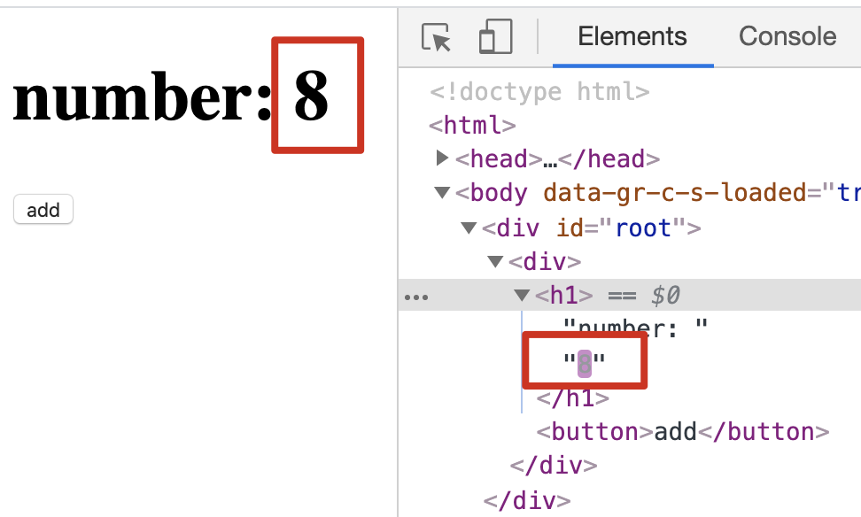

# diff 算法

- 对比真实 DOM 与 Virtual DOM 的区别，在对比过程中直接更新真实 DOM
- 因为很少跨层级移动 DOM，diff 只对比同一层级的变化

## 多种 diff

diff 算法相当于替代了[上一节](component.md)的`_render()`，先看一下`_render()`的代码，思考`diff`的过程：

```js
/**
 *
 * @param {*} vnode Virtual DOM
 * @return {HTMLElement}
 */
function _render(vnode) {
  // 基本类型全部转为字符串
  if (
    typeof vnode === "undefined" ||
    typeof vnode === "boolean" ||
    vnode === null
  )
    vnode = "";
  if (typeof vnode === "number") vnode = String(vnode);
  // Virtual DOM 是字符串类型，创建文本节点
  // NOTE diff 文本节点，两种情况
  // 1. 原DOM是文本节点，就更新文本内容
  // 2. 原DOM不是文本节点，就创建文本节点并替换
  if (typeof vnode === "string") {
    const textNode = document.createTextNode(vnode);
    return textNode;
  }
  // Virtual DOM 是自定义组件
  // NOTE diff 组件
  // 1. 原DOM对应的组件与自定义组件是同类，重新设置props
  // 2. 原DOM有对应组件，与自定义组件不是同类，卸载原DOM
  // 3. render自定义组件的真实DOM，对比原DOM，移除原DOM，返回更新后的DOM
  if (typeof vnode.tag === "function") {
    const component = createComponent(vnode.tag, vnode.attrs);
    setComponentProps(component, vnode.attrs);
    return component.dom;
  }
  // Virtual DOM是普通非文本节点
  // NOTE diff 普通非文本节点
  // 1. 真实DOM不存在，直接新建DOM
  // 2. 真实DOM存在，但和VDOM类型不同，需要将原DOM下的子节点转移到新DOM下，同时用新DOM替换原DOM
  const dom = document.createElement(vnode.tag);

  // NOTE diff 属性
  if (vnode.attrs) {
    Object.keys(vnode.attrs).forEach(key => {
      const value = vnode.attrs[key];
      setAttribute(dom, key, value);
    });
  }
  // NOTE diff 子节点
  vnode.children.forEach(child => render(child, dom));
  // 返回更新后的DOM
  return dom;
}
```

经过分析，可以得到`diff`的代码如下：

```js
/**
 * @param {HTMLElement} dom 真实DOM
 * @param {Object} vnode 虚拟DOM
 * @returns {HTMLElement} 更新后的DOM
 */
function diffNode(dom, vnode) {
  // 基本类型转字符串
  if (
    typeof vnode === "undefined" ||
    typeof vnode === "boolean" ||
    vnode === null
  )
    vnode = "";
  if (typeof vnode === "number") vnode = String(vnode);

  let updateDom = dom;
  // NOTE diff 文本节点
  if (typeof vnode === "string") {
    // 当前DOM就是文本节点，只需要更新内容即可
    if (dom && dom.nodeType === 3) {
      if (dom.textContent !== vnode) {
        dom.textContent = vnode;
      }
    }
    // 当前节点不是文本节点，创建一个文本节点来替换当前的DOM
    else {
      updateDom = document.createTextNode(vnode);
      if (dom && dom.parentNode) {
        dom.parentNode.replaceChild(updateDom, dom);
      }
    }
    return updateDom;
  }

  // NOTE diff 组件
  if (typeof vnode.tag === "function") {
    return diffComponent(dom, vnode);
  }

  // NOTE diff 普通非文本节点
  // 真实DOM不存在或类型不同，直接新建DOM
  if (!dom || !isSameNodeType(dom, vnode)) {
    updateDom = document.createElement(vnode.tag);
    // 如果真实DOM存在，将原DOM下的子节点转移到新DOM下
    if (dom) {
      [...dom.childNodes].map(node => updateDom.appendChild(node));
      if (dom.parentNode) {
        dom.parentNode.replaceChild(updateDom, dom);
      }
    }
  }

  // NOTE diff 属性
  diffAttributes(updateDom, vnode);

  // NOTE diff 子节点
  if (
    (updateDom.childNodes && updateDom.childNodes.length > 0) ||
    (vnode.children && vnode.children.length > 0)
  ) {
    diffChildren(updateDom, vnode.children);
  }
  // 返回更新后的DOM
  return updateDom;
}
```

可以看出，需要实现三个子方法，分别处理 diff 组件、diff 属性、diff 子节点。

## diff 组件

```js
/**
 *
 * @param {HTMLElement} dom
 * @param {Object} vnode
 * @returns {HTMLElement} 更新后的DOM
 */
function diffComponent(dom, vnode) {
  // 获取原DOM对应的组件实例
  let component = dom && dom._component;
  let oldDom = dom;
  // 原组件和更新组件是同类，只需要更新props，并重新render得到更新DOM
  if (component && component.constructor === vnode.tag) {
    setComponentProps(component, vnode.attrs);
    dom = component.dom;
  }
  // 原DOM不是自定义组件，或组件类型不同
  else {
    // 组件类型不同，需要执行当前组件的unmount周期方法
    if (component) {
      unmountComponent(component);
      oldDom = null;
    }
    // 原DOM不是组件渲染而来，创建组件并render出新的DOM
    component = createComponent(vnode.tag, vnode.attrs);
    setComponentProps(component, vnode.attrs);
    dom = component.dom;
    // 原DOM和新DOM不同，把原DOM从页面中移除
    if (oldDom && oldDom !== dom) {
      oldDom._component = null;
      removeNode(oldDom);
    }
  }
  return dom;
}
```

## diff 属性

```js
/**
 * 对比节点属性
 * @param {HTMLElement} dom 真实DOM
 * @param {Object} vnode 虚拟DOM
 */
function diffAttributes(dom, vnode) {
  let old = {};
  let attrs = vnode.attrs;

  // 存储原真实OM的属性
  for (let i = 0; i < dom.attributes.length; i++) {
    let attr = dom.attributes[i];
    old[attr.name] = attr.value;
  }

  // 把原真实DOM有、VDOM中没有的属性从真实DOM中移除，设置为undefined
  for (name in old) {
    if (!(name in attrs)) {
      setAttribute(dom, name, void 0);
    }
  }

  // 把VDOM中的属性更新在真实DOM上
  for (name in attrs) {
    if (old[name] !== attrs[name]) {
      setAttribute(dom, name, attrs[name]);
    }
  }
}
```

## diff 子节点

```js
/**
 *
 * @param {HTMLElement} dom 真实DOM
 * @param {Array} vchildren VDOM的children[]
 */
function diffChildren(dom, vchildren) {
  if (vchildren && vchildren.length > 0) {
    const domChildren = dom.childNodes;
    // 将有key值和没有key值的节点分开处理
    let domNoKeyChildren = [];
    let domKeyChildren = {};

    for (let i = 0; i < domChildren.length; i++) {
      const domChild = domChildren[i];
      if (domChild.key) {
        domKeyChildren[domChild.key] = domChild;
      } else {
        domNoKeyChildren.push(domChild);
      }
    }

    let count = 0; // 没有key的子节点已diff的个数
    let domNoKeyChildrenLen = domNoKeyChildren.length;
    for (let i = 0; i < vchildren.length; i++) {
      const vchild = vchildren[i];
      const vKey = vchild.key;
      // 新的子节点
      let child = void 0;
      // NOTE 先把原DOM的对应子节点赋给child
      // 分为有key和无key两种节点
      if (vKey) {
        // 原DOM子节点与虚拟DOM的子节点key相同
        // child赋值为原DOM对应的子节点，以便后面使用
        if (domKeyChildren[vKey]) {
          child = domKeyChildren[vKey];
          domKeyChildren[vKey] = void 0;
        }
      }
      // 当前虚拟DOM没有key，且没有diff的节点比原DOM子节点少
      else if (count < domNoKeyChildrenLen) {
        for (let j = count; j < domNoKeyChildrenLen; j++) {
          let oldDomChild = domNoKeyChildren[j];
          // 是同类型的节点才赋值，才需要diff，非同类型的在下面diffNode会创建新的节点
          if (oldDomChild && isSameNodeType(oldDomChild, vchild)) {
            child = oldDomChild;
            oldDomChild = void 0;
            if (j === domNoKeyChildrenLen - 1) domNoKeyChildrenLen--;
            if (j === count) count++;
            break;
          }
        }
      }
      // diff后更新的子节点DOM
      child = diffNode(child, vchild);
      // i是已vchildren为基础的，ref是原DOM与vchildren同index下的子节点
      const ref = domChildren[i];
      if (child && child !== dom && child !== ref) {
        // ref 是 undefined，vchildren比domChildren要多，在原DOM下增加当前子节点
        if (!ref) {
          dom.appendChild(child);
        }
        // 当前子节点是ref的下一个，存在于原DOM上，移除ref
        else if (child === ref.nextSibling) {
          removeNode(ref);
        }
        // 当前子节点需要加在ref的前面
        else {
          dom.insertBefore(child, ref);
        }
      }
    }
  }
}
```

## 调用

原`_render`可以不再使用，所有`_render`的部分可以用`diffNode`替换，也就是只更新变化的部分，而不是重新 render。

diff 的核心在于，组件的 state 改变时，在原有 DOM 的基础上做改动，而不是返回一个新的 DOM 去替换原来的。

下图，在点击 button 后，仅有数字部分做了修改，其余部分保持原样。


