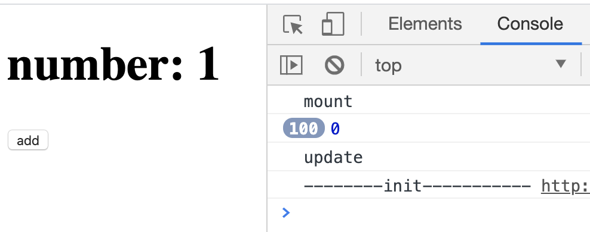
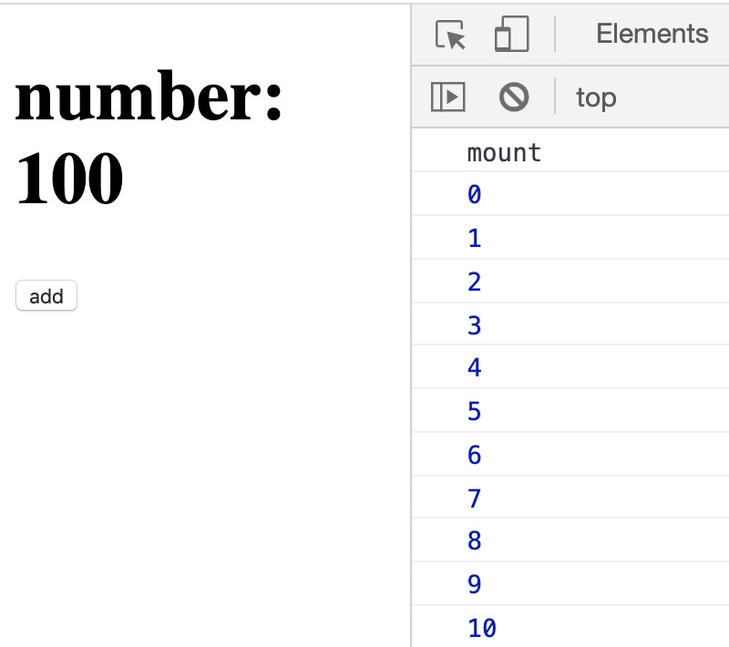

# setState 异步处理

- setState 是通过一个队列机制更新 state，批量更新 state，而不是立即更新，所以要把短时间内的多个 setState 合并。
- 可以接受函数作为参数，函数可以得到前一个状态，并返回下一个状态。

```js
componentDidMount() {
  console.log("mount");
  for (let i = 0; i < 100; i++) {
    // NOTE 接受Object，因为是批量更新，state在100次更新里接收的值不变
    this.setState({ num: this.state.num + 1 });
    console.log(this.state.num);
    // NOTE 接受函数，得到prevState，更新到新的state上
    this.setState(prevState => {
      console.log(prevState.num);
      return { num: prevState.num + 1 };
    });
  }
}
```

## 队列机制

JavaScript 的数组 API 可以用`push`和`shift`完成队列先进先出的需求。

```js
const queue = [];
function enqueueSetState(stateChange, component) {
  queue.push({
    stateChange,
    component
  });
}
```

清空队列：

```js
function flush() {
  let item;
  while ((item = queue.shift())) {
    const { stateChange, component } = item;
    if (!component.prevState) {
      component.prevState = Object.assign({}, component.state);
    }
    if (typeof stateChange === "function") {
      Object.assign(
        component.state,
        stateChange(component.prevState, component.props)
      );
    } else {
      Object.assign(component.state, stateChange);
    }
    component.prevState = component.state;
  }
}
```

现在已经将 state 更新合并，需要重新渲染组件，一个组件可以更新多次 state，但只需要渲染一次，增加`renderQueue`保存组件。

```js
const queue = [];
const renderQueue = [];
function enqueueSetState(stateChange, component) {
  queue.push({
    stateChange,
    component
  });
  // 如果renderQueue里没有当前组件，则添加到队列中
  if (!renderQueue.some(item => item === component)) {
    renderQueue.push(component);
  }
}
```

```js
function flush() {
  let item, component;
  // 合并stateChange...
  while ((component = renderQueue.shift())) {
    renderComponent(component);
  }
}
```

## 执行清空

利用 JS 引擎的 event-loop，先执行同步任务，再清空微任务队列，最后执行一个宏任务。在组件调用`setState`的 for-loop 是同步方法，要让`flush()`在同步任务完成后再执行。可以采用`Promise.resolve()`或`setTimeout()`。

```js
function defer(fn) {
  return Promise.resolve().then(fn);
}
function enqueueSetState(stateChange, component) {
  // 每次队列清空后，添加一次异步事件，引擎会在执行完同步事件后处理这个异步函数
  if (queue.length === 0) {
    defer(flush);
  }
  // ...
}
```

## 调用

### 传入对象

```js
componentDidMount() {
  console.log("mount");
  for (let i = 0; i < 100; i++) {
    // NOTE 接受Object，因为是批量更新，state在100次更新里接收的值不变
    this.setState({ num: this.state.num + 1 });
    console.log(this.state.num);
  }
}
```



### 传入函数

```js
componentDidMount() {
  console.log("mount");
  for (let i = 0; i < 100; i++) {
    // NOTE 接受函数，得到prevState，更新到新的state上
    this.setState(prevState => {
      console.log(prevState.num);
      return { num: prevState.num + 1 };
    });
  }
}
```

