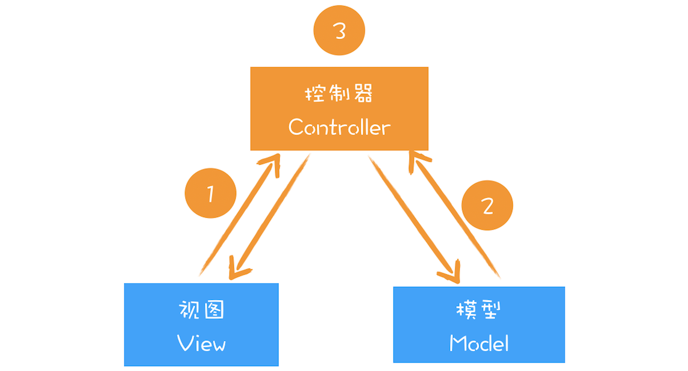

# 虚拟 DOM 与实际 DOM 的比较

## DOM 的缺陷

JS 操纵 DOM 会影响渲染流程，可能触发重排、重绘和合成操作，有时还会引起强制同步布局和布局抖动的问题。

## 虚拟 DOM

1. 创建阶段。根据 JSX 创建出虚拟 DOM，反映了真实 DOM 树的结构，由虚拟 DOM 创建出真实 DOM 树，之后触发渲染流水线输出页面。
2. 更新阶段。根据新的数据创建新的虚拟 DOM 树，比较两个树，找出变化，把变化的地方一次性更新到真实 DOM 树上，再油渲染引擎更新渲染流水线，生成新页面。

### Fiber 机制

之前的 diff 算法是在一个递归函数中执行，但是当虚拟 DOM 很复杂时，diff 函数会占据主线程很长时间，导致其他任务的等待。

Fiber 的核心是，在执行算法的过程中让出主线程，解决了上面的问题。

### 双缓存

虚拟 DOM 可以看出 DOM 的 buffer，在完成一次完整操作后，再把结果应用到 DOM 上，减少不必要的更新，保证 DOM 的稳定输出。

### MVVM

MVVM 的核心思想是将数据与视图分离，两者的通信由控制器完成。

基于 React 和 Redux 构建的项目中，虚拟 DOM 就充当了视图部分，Redux 是控制器和模型。

- Controller 监控真实 DOM 的变化，DOM 发生变化，控制器会通知模型，让其更新数据。
- Model 更新好数据，Controller 通知视图，模型数据已改变。
- 视图收到消息后，生成新的虚拟 DOM。
- diff 新旧虚拟 DOM，找出变化节点。
- React 将变化的节点应用到真实 DOM 上，触发 DOM 节点更新。
- DOM 节点更新，触发浏览器渲染引擎工作，实现页面的更新。
